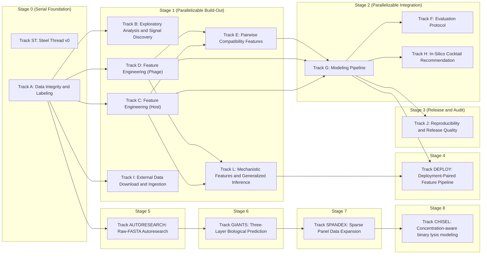

# Lyzor Tx In-Silico Pipeline Plan

## Parallel Execution View

- Tracks in the same stage box can run in parallel unless blocked by their own incoming dependencies.

## Track ST: Steel Thread v0

- **Guiding Principle:** Prove end-to-end viability with a minimal but honest pipeline using internal data only.
- [x] **ST01** Define v0 label policy and uncertainty flags from raw interactions. Implemented in
      `lyzortx/pipeline/steel_thread_v0/steps/st01_label_policy.py`. Regression baseline:
      `lyzortx/pipeline/steel_thread_v0/baselines/st01_expected_metrics.json`.
- [x] **ST01B** Add strict confidence tiering as a parallel output from ST0.1 to support dual-slice evaluation.
      Implemented in `lyzortx/pipeline/steel_thread_v0/steps/st01b_confidence_tiers.py`. Regression baseline:
      `lyzortx/pipeline/steel_thread_v0/baselines/st01b_expected_metrics.json`.
- [x] **ST02** Build one canonical pair table with IDs, labels, uncertainty, and v0 feature blocks. Implemented in
      `lyzortx/pipeline/steel_thread_v0/steps/st02_build_pair_table.py`. Regression baseline:
      `lyzortx/pipeline/steel_thread_v0/baselines/st02_expected_metrics.json`.
- [x] **ST03** Lock one leakage-safe split protocol and one fixed holdout benchmark for v0. Implemented in
      `lyzortx/pipeline/steel_thread_v0/steps/st03_build_splits.py`. Regression baseline:
      `lyzortx/pipeline/steel_thread_v0/baselines/st03_expected_metrics.json`.
- [x] **ST04** Train one strong tabular baseline and one simple comparator baseline. Implemented in
      `lyzortx/pipeline/steel_thread_v0/steps/st04_train_baselines.py`. Regression baseline:
      `lyzortx/pipeline/steel_thread_v0/baselines/st04_expected_metrics.json`.
- [x] **ST05** Calibrate probabilities and export ranked per-strain phage predictions. Implemented in
      `lyzortx/pipeline/steel_thread_v0/steps/st05_calibrate_rank.py`. Regression baseline:
      `lyzortx/pipeline/steel_thread_v0/baselines/st05_expected_metrics.json`.
- [x] **ST06** Generate top-3 recommendations with policy-tuned defaults. Implemented in
      `lyzortx/pipeline/steel_thread_v0/steps/st06_recommend_top3.py`. Regression baseline:
      `lyzortx/pipeline/steel_thread_v0/baselines/st06_expected_metrics.json`.
- [x] **ST06B** Compare ranking policy variants to avoid recommendation-policy regressions. Implemented in
      `lyzortx/pipeline/steel_thread_v0/steps/st06b_compare_ranking_policies.py`.
- [x] **ST07** Emit one reproducible report to generated_outputs/steel_thread_v0/. Implemented in
      `lyzortx/pipeline/steel_thread_v0/steps/st07_build_report.py`. Regression baseline:
      `lyzortx/pipeline/steel_thread_v0/baselines/st07_expected_metrics.json`.
- [x] **ST08** Add dual-slice reporting (full-label and strict-confidence) to ST0.7
  - ST0.7 report includes separate metric rows for full-label and strict-confidence slices
  - Both slices report top-3 hit rate, calibration ECE, and Brier score
- [x] **ST09** Document failure case hypotheses for each major holdout miss error bucket
  - Each holdout miss strain in error_analysis.csv has at least one documented hypothesis
  - Hypotheses are written to the track lab notebook with actionable next steps

## Track A: Data Integrity and Labeling

- **Guiding Principle:** Canonical IDs, label policies, cohort contracts, and replicate-aware label sets from raw data.
- [x] **TA01** Build a canonical ID map for bacteria and phages across all tables. Implemented in
      `lyzortx/generated_outputs/track_a/id_map/{bacteria_id_map.csv,phage_id_map.csv}`.
- [x] **TA02** Resolve naming/alias mismatches (for example legacy phage names). Implemented in
      `lyzortx/generated_outputs/track_a/id_map/{bacteria_alias_resolution.csv,phage_alias_resolution.csv}`.
- [x] **TA03** Add automated data integrity checks for row/column consistency. Implemented in
      `lyzortx/pipeline/track_a/checks/check_track_a_integrity.py`.
- [x] **TA04** Define and document handling policy for uninterpretable labels (score='n'). Implemented in
      `lyzortx/generated_outputs/track_a/labels/{label_set_v1_policy.json,label_set_v2_policy.json}`.
- [x] **TA05** Add plaque-image-assisted QC pass for ambiguous/conflicting pairs. Implemented in
      `lyzortx/generated_outputs/track_a/qc/{plaque_image_qc_queue.csv,plaque_image_qc_summary.json}`.
- [x] **TA06** Define cohort contracts and denominator rules for all reports. Implemented in
      `lyzortx/generated_outputs/track_a/cohort/{cohort_contracts.csv,cohort_contracts.json}`.
- [x] **TA07** Preserve replicate and dilution structure in intermediate tables. Implemented in
      `lyzortx/generated_outputs/track_a/labels/track_a_observations_with_ids.csv`.
- [x] **TA08** Create label set v1: any_lysis, lysis_strength, dilution_potency, uncertainty_flags. Implemented in
      `lyzortx/generated_outputs/track_a/labels/label_set_v1_pairs.csv`.
- [x] **TA09** Create label set v2 with alternative aggregation assumptions and compare impact. Implemented in
      `lyzortx/generated_outputs/track_a/labels/{label_set_v2_pairs.csv,label_set_v1_v2_comparison.csv}`.
- [x] **TA10** Add scripts that regenerate all derived labels from raw data in one command. Implemented in
      `lyzortx/pipeline/track_a/run_track_a.py`.
- [x] **TA11** Fix label policy for borderline matrix_score=0 pairs. Model: `gpt-5.4-mini`.
  - Identify the 2557 pairs where aux_matrix_score_0_to_4=0 but label_hard_any_lysis=1 (single-replicate noise
    positives)
  - Add a label_v3 policy that sets label_hard_any_lysis=0 for these pairs, or add a training weight that downweights
    them
  - Retrain the locked v1 model with the corrected labels and report AUC, top-3, Brier delta
  - VHRdb analysis showed +3.1pp top-3 from downweighting these pairs, so expect a similar improvement
  - Document the label policy change in the Track A lab notebook

## Track B: Exploratory Analysis and Signal Discovery

- **Guiding Principle:** Profile interactions, identify hard-to-lyse strains, rescuer phages, and dilution-response
  patterns.
- [x] **TB01** Profile raw interaction matrix composition and replicate consistency
- [x] **TB02** Quantify morphotype breadth and narrow-susceptibility patterns
- [x] **TB03** Characterize hard-to-lyse strains by known host traits
  - Identify strains with zero or very few lytic phages in the interaction matrix
  - Report which host metadata fields (serotype, phylogroup, ST) correlate with low susceptibility
  - Output a summary CSV and findings in the track lab notebook
- [x] **TB04** Characterize rescuer phages for narrow-susceptibility strains
- [x] **TB05** Analyze dilution-response patterns per phage and per bacterial subgroup

## Track C: Feature Engineering (Host)

- **Guiding Principle:** Defense-system subtypes, OMP receptor variants, capsule/LPS detail, and phylogenomic embeddings
  for host strains.
- [x] **TC01** Build defense-system subtype feature block from defense_finder annotations
  - Ingest 370+host_defense_systems_subtypes.csv (138 subtype columns, 404 strains)
  - Variance filter drops subtypes present in <5 or >395 strains
  - Derived features include defense diversity, CRISPR presence, Abi burden
  - Output CSV joinable on bacteria column with ~60-80 informative features
- [x] **TC02** Build OMP receptor variant feature block from BLAST cluster assignments
  - Ingest blast_results_cured_clusters=99_wide.tsv (12 receptor proteins, 404 strains)
  - Encode cluster IDs as categoricals (one-hot top-k, group rare clusters)
  - Output CSV joinable on bacteria column with ~20 receptor features
- [x] **TC03** Build extended host surface features (capsule detail, LPS core, UMAP embeddings)
  - Add Klebsiella-type capsule, LPS core type, and 8D UMAP phylogenomic embeddings
  - All features joinable on bacteria column
  - Missingness indicators added for features with incomplete coverage
- [x] **TC04** Integrate host feature blocks into v1 pair table
  - All host feature blocks merged into a single host feature matrix
  - Join completeness verified (no unexpected NaN increase vs source data)
  - Quick LightGBM sanity check on training fold confirms lift over v0

## Track D: Feature Engineering (Phage)

- **Guiding Principle:** RBP features, genome k-mer embeddings, and phage distance embeddings from existing genomic
  data.
- [x] **TD01** Build RBP feature block from RBP_list.csv annotations
  - Parse per-phage RBP count, has_fiber, has_spike, RBP type composition
  - Handle NAs with indicator features for missing RBP annotations
  - Output CSV joinable on phage column with ~5-8 features
- [x] **TD02** Build genome k-mer embedding features from phage FNA files
  - Compute tetranucleotide (k=4) frequency vectors from 97 FNA genomes
  - Reduce via SVD to 20-30 dimensions
  - Add GC content and continuous genome length
  - Output CSV joinable on phage column with ~25-30 features
- [x] **TD03** Build phage distance embedding from VIRIDIC phylogenetic tree
  - Extract pairwise distances from 96_viridic_distance_phylogenetic_tree_algo=upgma.nwk
  - Compute MDS embedding to 5-8 dimensions
  - Output CSV joinable on phage column

## Track E: Pairwise Compatibility Features

- **Guiding Principle:** RBP-receptor compatibility, defense evasion proxy, and phylogenetic distance features that
  break the popular-phage bias.
- [x] **TE01** Build RBP-receptor compatibility features from curated genus-receptor lookup
  - Curated lookup mapping phage genus/subfamily to known primary receptor targets
  - Per-pair features include target_receptor_present, receptor_cluster_matches,
    receptor_variant_seen_in_training_positives
  - Output CSV joinable on bacteria+phage pair with ~5-8 features
- [x] **TE02** Build defense evasion proxy features from training-fold collaborative filtering
  - For each phage family, compute average lysis rate against each defense subtype from training data only
  - Per-pair expected evasion score computed as sum of phage family success rates against host defense systems
  - Leakage verified by computing on training fold only, never holdout
- [x] **TE03** Build phylogenetic distance to isolation host features
  - UMAP Euclidean distance between target host and phage isolation host
  - Defense Jaccard distance between target host and phage isolation host
  - Output CSV joinable on bacteria+phage pair with ~3-4 features

## Track F: Evaluation Protocol

- **Guiding Principle:** Lock v1 benchmark split and add bootstrap confidence intervals. ST03 already provides
  leakage-safe host-group and phage-family holdouts. TF01/TF02 are done but their metrics are invalidated by the
  label-leakage fix — they will be re-run as part of TG06.
- [x] **TF01** Lock ST03 split as v1 benchmark and add bootstrap CIs for all metrics. Model: `gpt-5.4-mini`.
  - Existing ST03 split locked as the canonical v1 evaluation protocol
  - Bootstrap CIs (1000 resamples of holdout strains) for top-3 hit rate, AUC, Brier score, and ECE
  - Dual-slice reporting (full-label and strict-confidence) for all metrics
- [x] **TF02** Before/after comparison of v0 vs v1 with error bucket analysis. Model: `gpt-5.4-mini`.
  - Side-by-side metrics table for v0 (metadata logreg) vs v1 (genomic GBM)
  - Error bucket analysis showing which v0 holdout misses v1 fixed and why
  - Honest reporting of strains that remain unpredictable

## Track G: Modeling Pipeline

- **Guiding Principle:** LightGBM model on expanded genomic features with calibration, ablation, and SHAP
  interpretation.
- [x] **TG01** Train LightGBM binary classifier on v1 expanded feature set
  - LightGBM with hyperparameter tuning via 5-fold CV on existing leakage-safe cv_groups
  - Logistic regression kept as interpretable comparator
  - Target AUC 0.87-0.90 and top-3 hit rate 90%+
- [x] **TG02** Calibrate GBM outputs with isotonic and Platt scaling
  - Same calibration approach as ST05 applied to GBM
  - Report ECE, Brier, log-loss for both calibration methods
  - Target ECE < 0.03 on full-label
- [x] **TG03** Run feature-block ablation suite proving which features deliver lift
  - Ablation arms: v0 features only, +defense subtypes, +OMP receptors, +phage genomic, +pairwise compatibility, all
    features
  - Each arm reports AUC, top-3 hit rate, Brier on same holdout split
  - v0 baseline is reference point in all comparisons
- [x] **TG04** Compute SHAP explanations for per-pair and global feature importance. Model: `gpt-5.4`.
  - TreeExplainer SHAP values for GBM model
  - Per-pair explanations answering why each phage was recommended for each strain
  - Global feature importance ranking across the panel
  - Per-strain summary of what makes each strain hard or easy to predict
  - Concrete recommendation of which feature blocks to keep in final v1 model, based on SHAP evidence and TG03 ablation
    results
- [x] **TG05** Run feature-subset sweep to find best block combination for top-3 ranking. Model: `gpt-5.4`.
  - Train models on all 2-block and 3-block combinations of the 4 new feature blocks (defense, OMP, phage-genomic,
    pairwise)
  - Reuse the TG01 winning hyperparameters for all sweep arms — do NOT run per-arm hyperparameter search. The goal is to
    isolate the feature-block effect, not confound it with per-arm tuning differences.
  - Report top-3 hit rate, AUC, and Brier on the same ST03 holdout for each combo
  - Identify the winning subset that maximizes top-3 hit rate without degrading AUC
  - Compare winning subset against the TG01 all-features model
  - Include a deployment-realistic arm that excludes all features derived from training labels
    (legacy_label_breadth_count, legacy_receptor_support_count) to measure generalization to truly novel strains
  - Report both panel-evaluation and deployment-realistic metrics for the winning configuration
  - Lock the final v1 feature configuration for downstream Track F and H
- [x] **TG06** Delete label-leaked features from the feature pipeline. Model: `gpt-5.4-mini`.
  - Remove legacy_label_breadth_count: delete the (n_infections, legacy_label_breadth_count) rename in
    st02_build_pair_table.py and drop the column from ST02 output
  - Remove legacy_receptor_support_count: delete its construction in build_rbp_receptor_compatibility_feature_block.py
    (Track E) and drop it from the TE01 output schema
  - Remove the LABEL_DERIVED_COLUMNS list in run_feature_subset_sweep.py and the deployment-realistic arm logic that
    depends on it
  - Delete v1_config_keys.py and simplify v1_feature_configuration.json to a single flat feature config (no
    panel_default vs deployment_realistic_sensitivity split)
  - Grep the entire lyzortx/ tree for legacy_label_breadth_count and legacy_receptor_support_count — zero hits must
    remain
  - All existing tests pass after deletions
- [x] **TG07** Retrain, recalibrate, and re-run SHAP and ablation on the clean feature set. Model: `gpt-5.4-mini`.
  - Retrain LightGBM on the clean feature set (reuse TG01 hyperparameters)
  - Recalibrate (isotonic + Platt) and report AUC, top-3, Brier, ECE
  - Re-run SHAP explanations on the clean model
  - Re-run feature-block ablation on the clean feature set
  - Update v1_feature_configuration.json with the clean model metrics
- [x] **TG08** Re-run downstream tracks and verify end-to-end pipeline. Model: `gpt-5.4-mini`.
  - Re-run explained recommendations (Track H) against clean model outputs
  - Re-run v0-vs-v1 evaluation (Track F) against clean model metrics
  - Run python -m lyzortx.pipeline.track_j.run_track_j end-to-end and verify it completes without error on the clean
    pipeline
  - The old label-leaked metrics must not appear in any output
- [x] **TG09** Fix LightGBM determinism and lock defense + phage_genomic as v1 winner. Model: `gpt-5.4-mini`.
  - Add deterministic=True to make_lightgbm_estimator in train_v1_binary_classifier.py
  - Remove n_jobs=1 from make_lightgbm_estimator (deterministic=True handles thread safety, force_col_wise=True is
    already set)
  - Update v1_feature_configuration.json to lock defense + phage_genomic as the winner (exclude pairwise block — 5 of 13
    features are training-label-derived)
  - Remove the feature-subset-sweep step from Track J's run_track_j.py so the lock file is treated as a human decision,
    not a regenerated output
  - Verify two consecutive runs of run_track_g.py --step train-v1-binary produce identical outputs
- [x] **TG10** Re-run downstream tracks on the stable 2-block lock. Model: `gpt-5.4-mini`.
  - Re-run Track H explained recommendations against the 2-block model outputs
  - Re-run Track F v0-vs-v1 evaluation against the 2-block model metrics
  - Run python -m lyzortx.pipeline.track_j.run_track_j end-to-end and verify it completes without error
  - Verify v1_feature_configuration.json is unchanged after the Track J run (sweep no longer regenerates it)
- [x] **TG11** Investigate non-leaky features that close the calibration gap. Model: `gpt-5.4`.
  - Pairwise soft leakage context: TE02 defense_evasion_* features (4) and TE01
    receptor_variant_seen_in_training_positives (1) are training-label-derived via collaborative filtering. Do not
    include these in candidate features.
  - Clean pairwise candidates to evaluate individually: TE03 isolation_host distances (2 features) and TE01 curated
    lookup features (lookup_available, target_receptor_present, protein_target_present, surface_target_present,
    receptor_cluster_matches)
  - Propose and test at least two candidate features (from clean pairwise or other sources) that do not leak training
    labels
  - Report whether any candidate recovers >50% of the AUC gap between the 2-block model (~0.837) and the old leaked
    model (~0.911) without degrading top-3
  - If no candidate closes the gap, accept the 2-block calibration as the honest v1 baseline
- [x] **TG12** Delete soft-leaky training-label-derived features from Track E code. Model: `gpt-5.4-mini`.
  - Delete the legacy soft-leaky pairwise block from Track E code
  - Remove the exact-variant training-positive flag from the RBP-receptor compatibility block
  - Update downstream tests that assert on removed columns
  - Grep lyzortx/ for the removed pairwise feature names — zero hits outside lab notebooks
  - All existing tests pass after deletions

## Track H: In-Silico Cocktail Recommendation

- **Guiding Principle:** Top-k recommendations with SHAP-based explanations. TH01/TH02 are done but will be re-run as
  part of TG06 against the clean model.
- [x] **TH01** Benchmark policy variants for top-k recommendation and lock a non-regressing default
- [x] **TH02** Add explained recommendations with calibrated P(lysis), CI, and SHAP features. Model: `gpt-5.4-mini`.
  - Each top-3 recommendation includes calibrated P(lysis), 95% CI, and top-3 SHAP features
  - Output format suitable for clinician or CDMO operator review
  - Report covers all holdout strains

## Track I: External Data Download and Ingestion

- **Guiding Principle:** Download and ingest external phage-host interaction data from public sources. TI07-TI10
  (confidence tiers, training cohorts, ablations, lift analysis) were deleted — external data has zero overlap with the
  internal panel for training. See v1 archive for historical Track K lift measurement results.
- [x] **TI01** Create a curated reading list of closely related phage-host prediction papers. Implemented in
      `lyzortx/research_notes/LITERATURE.md`.
- [x] **TI02** Build source_registry.csv for all external sources. Implemented in
      `lyzortx/research_notes/external_data/source_registry.csv`.
- [x] **TI03** Download and ingest VHRdb pairs with source-fidelity fields. Model: `gpt-5.4`.
  - Download VHRdb data from https://phage.ee.cityu.edu.hk/ into lyzortx/generated_outputs/track_i/tier_a_ingest/
  - Output CSV contains >0 real bacteria-phage pairs
  - Each row preserves raw global_response and datasource_response without case folding
  - source_datasource_id, source_disagreement_flag, and source_native_record_id populated
  - Raise FileNotFoundError or request error on download failure, never silently skip
- [x] **TI04** Download and ingest Tier A sources: BASEL, KlebPhaCol, GPB. Model: `gpt-5.4`.
  - Download BASEL from publication supplement, KlebPhaCol from https://klebphacol.com/, GPB from https://phagebank.org/
  - Each source produces an ingested CSV with >0 rows under lyzortx/generated_outputs/track_i/tier_a_ingest/
  - All rows carry source_system provenance
  - Raise on download failure, do not silently produce empty output
- [x] **TI05** Harmonize Tier A datasets to internal schema. Model: `gpt-5.4`.
  - Map external bacteria and phage names to canonical IDs via Track A alias resolution
  - Report how many external pairs overlap with the internal 404x96 panel vs are novel
  - Output a harmonized pair table with >0 rows joinable on pair_id
  - Raise ValueError if harmonization produces zero joinable rows
- [x] **TI06** Download and ingest Tier B: Virus-Host DB and NCBI BioSample metadata. Model: `gpt-5.4`.
  - Download Virus-Host DB associations from https://www.genome.jp/virushostdb/
  - Download NCBI Virus/BioSample metadata via Entrez API
  - Each source produces an ingested CSV with >0 rows
  - BioSample host_disease and isolation_host fields parsed from XML attributes
  - Raise on empty API responses or download failures

## Track L: Mechanistic Features and Generalized Inference

- **Guiding Principle:** Original two-goal track: (1) test annotation-derived mechanistic pairwise features as
  replacements for deleted label-derived pairwise blocks, and (2) build a generalized inference pipeline for arbitrary
  genomes. TL12 dead-ended goal (1) for the current v1 lock: the enrichment-derived pairwise path did not produce an
  honest lift. The remaining Track L question is whether a materially richer, fully deployable bundle with
  genome-derivable compatibility signal can improve round-trip behavior enough to justify broader external validation.
- [x] **TL01** Annotate all 97 phage genomes with Pharokka. Model: `gpt-5.4-mini`.
  - Add bioconda dependencies (pharokka, mmseqs2, trnascan-se, minced, aragorn, mash, dnaapler) to environment.yml and
    verify pharokka runs in CI
  - Run Pharokka on all 97 FNA files in data/genomics/phages/FNA/
  - Store annotations under lyzortx/generated_outputs/track_l/pharokka_annotations/
  - Parse the CDS functional annotations into a per-phage summary table with counts by PHROGs category (tail, lysis,
    defense, etc.)
  - Extract per-phage RBP gene list with functional family annotations
  - Extract per-phage anti-defense gene list (anti-restriction, anti-CRISPR, etc.)
  - All 97 phages must produce >0 annotated CDS
- [x] **TL02** Build annotation-interaction enrichment module and run PHROG x receptor/defense analysis. Model:
      `gpt-5.4`.
  - Build a reusable enrichment module (annotation_interaction_enrichment.py) that takes any (phage binary feature
    matrix, host binary feature matrix, interaction matrix) and produces a Fisher's exact test enrichment table with
    odds ratios, p-values, and Benjamini-Hochberg corrected significance
  - Run three enrichment analyses: (1) RBP PHROG IDs (43) x OMP receptor variant clusters (22), (2) RBP PHROG IDs (43) x
    LPS core type (~5), (3) anti-defense gene PHROG IDs x defense system subtypes (82)
  - Each analysis uses the full interaction matrix (positive and negative outcomes), not just generalist/specialist
    tails
  - Output enrichment tables as CSVs under lyzortx/generated_outputs/track_l/enrichment/
  - Document which PHROG-receptor and PHROG-defense associations are significant (BH-corrected p < 0.05) in the track_L
    lab notebook
  - These results directly inform whether TL03 builds pairwise features from the learned associations or falls back to
    the PHROG binary matrix
- [x] **TL03** Build mechanistic RBP-receptor compatibility features from annotations. Model: `gpt-5.4`.
  - Collapse duplicate PHROG carrier profiles before feature construction (32 PHROGs reduce to ~25 unique profiles due
    to co-occurrence groups like 136/15437/4465/9017 and 1002/1154/967/972)
  - Use TL02 enrichment results (380 significant RBP PHROG x OMP/LPS associations) to build pairwise features for each
    phage-host pair — use lysis_rate_diff from the enrichment CSV as feature weights (better-behaved than odds ratios)
  - Also include the phage x RBP-PHROG binary matrix (collapsed to unique profiles) as a direct phage-level feature
    block
  - Features must be derived from genome annotations only, not from training labels
  - Output CSV joinable on bacteria+phage pair
  - Compare against the existing RBP_list.csv curated annotations as a sanity check
- [x] **TL04** Build mechanistic defense-evasion features from annotations. Model: `gpt-5.4`.
  - Use TL02 enrichment results to build pairwise features for each phage-host pair — does the phage encode anti-defense
    genes whose PHROG families are significantly associated with lysis of hosts carrying specific defense systems?
  - Features must be derived from Pharokka anti-defense annotations, not from training label collaborative filtering
  - Output CSV joinable on bacteria+phage pair
  - Caveat: TL02 found only 27 significant anti-defense x defense associations (2.9%), weaker than the RBP-receptor
    signal. Generic methyltransferase annotations inflate the anti-defense gene set. Treat these as experimental
    candidates — include in TL05 evaluation as a separate optional block
- [x] **TL05** Retrain v1 model with mechanistic pairwise features and measure lift. Model: `gpt-5.4-mini`.
  - Evaluate TL03 (RBP-receptor) and TL04 (defense-evasion) features separately, not as a bundle — TL04 signal is weaker
    and may hurt rather than help
  - Add features to the locked defense + phage_genomic baseline
  - Retrain with TG01 hyperparameters on the ST03 holdout split
  - Report AUC, top-3, Brier delta vs the current locked baseline for each feature block independently and combined
  - If mechanistic features improve metrics, propose a new locked v1 config
  - Run SHAP on the new model to verify mechanistic features contribute signal
- [x] **TL06** Persist fitted transforms for novel-organism feature projection. Model: `gpt-5.4-mini`.
  - Save the TD02 fitted TruncatedSVD object via joblib alongside the k-mer feature CSV so novel phage FNAs can be
    projected into the existing 24-dim embedding
  - Save the TC01 defense subtype column mask (variance filter thresholds and ordered column list) so novel Defense
    Finder outputs map to the same 79 feature columns
  - Add project_novel_phage(fna_path, svd_path) function that computes tetranucleotide frequencies + GC + genome length
    and returns the model-ready phage feature vector
  - Add project_novel_host(defense_finder_output_path, column_mask_path) function that parses Defense Finder output into
    the model-ready host feature vector
  - Round-trip test on one panel phage and one panel host confirms output matches the pre-computed feature table within
    floating-point tolerance
- [x] **TL07** Build Defense Finder runner for novel E. coli genomes. Model: `gpt-5.4`.
  - Input is a genome assembly FASTA file for a novel E. coli strain
  - Pipeline runs Pyrodigal for gene prediction then Defense Finder for defense system annotation
  - Output is parsed into the same 79-column defense subtype vector the locked model expects, using the column mask from
    TL06
  - Add defense-finder to environment.yml (pip-installable via PyPI)
  - Test by running on one publicly available E. coli genome (e.g., K-12 MG1655) and verifying >0 defense systems
    detected
  - End-to-end test confirms the output vector has the correct shape and column names matching the training feature set
- [x] **TL08** Build generalized inference function for arbitrary genomes. Model: `gpt-5.4`.
  - Function signature: infer(host_genome_path, phage_fna_paths, model_path) returning DataFrame with columns phage,
    p_lysis, rank
  - Computes host defense features via TL07 runner
  - Computes phage k-mer features via TL06 saved SVD transform
  - Creates cross-product of (1 host x N phages), scores with trained LightGBM, applies isotonic calibration, ranks by
    calibrated probability
  - No dependency on the static pair table or the 404-strain panel metadata
  - Integration test using one panel strain genome reproduces the locked model predictions for that strain within
    calibration tolerance
- [x] **TL09** Validate generalized inference on Virus-Host DB positive pairs. Model: `gpt-5.4`.
  - Mine Virus-Host DB for E. coli strain-level hosts (tax_id != 562) with phage genome accessions on NCBI — expect ~70
    strains, ~900 phage genomes, ~500 positive pairs
  - Download genome assemblies from NCBI for at least 10 novel hosts (strains not in the 404 training panel) that each
    have >=5 associated phage genomes
  - Download the associated phage genome FNA files from NCBI
  - Run the TL08 generalized inference function on each novel host x its associated phages plus the 96 panel phages
    (rank known-positive phages against the full union of panel + VHdb phages for that host)
  - Positive-only validation metrics: (a) median predicted P(lysis) for known positive pairs — expect significantly
    above the population base rate of ~30%, (b) for each host, rank of known-positive phages among all candidate phages
    in the union set — expect above-median rank, (c) calibration check — predicted P(lysis) for known positives should
    be higher than for random host-phage pairs from the same union set
  - Also run on panel hosts that appear in VHdb (e.g., LF82, EDL933, 55989) as a round-trip sanity check — predictions
    from genome-derived features should match the pair-table path
  - Document limitations in lab notebook — these are positive-only pairs (no negatives), so AUC and top-3 hit rate
    cannot be computed
- [x] **TL10** Fix enrichment holdout leak — TL02 uses full interaction matrix including ST03 holdout strains. Model:
      `gpt-5.4-mini`.
  - Bug: TL02 (PR #259) computes PHROG x receptor/defense enrichment on the full 369x96 interaction matrix including
    ST03 holdout strains. The enrichment weights encode holdout outcomes and leak test information into TL03/TL04
    features.
  - Root cause: TL02 acceptance criteria said "each analysis uses the full interaction matrix (positive and negative
    outcomes), not just generalist/specialist tails". The intent was to use both positives and negatives (correct), but
    the criteria failed to require holdout exclusion.
  - Bug location 1 — run_enrichment_analysis.py:6: docstring says "using the full interaction matrix"
  - Bug location 2 — run_enrichment_analysis.py:394: loads label_set_v1_pairs.csv (all 369 bacteria) with no split
    filtering
  - Bug location 3 — run_enrichment_analysis.py:409-423: builds bacteria list from all label rows with no holdout
    exclusion
  - Bug location 4 — annotation_interaction_enrichment.py:96-105: compute_enrichment() has no holdout parameter
  - What is NOT broken: the permutation test itself is statistically sound. Only the input data selection is wrong.
  - Fix: add a holdout_bacteria parameter to run_enrichment_analysis.py that accepts bacteria IDs to exclude. Load ST03
    split assignments and filter holdout bacteria rows from the interaction matrix, host feature matrices, and resolved
    mask BEFORE calling compute_enrichment(). Do not modify compute_enrichment() itself.
  - Add a unit test verifying that holdout bacteria are absent from the matrices passed to compute_enrichment()
  - Add a null-calibration regression test that runs enrichment on random binary features and asserts FPR is below 10%
    at alpha 0.05
  - Rerun all three enrichment analyses with the holdout-excluded matrix and output updated CSVs to
    lyzortx/generated_outputs/track_l/enrichment/
  - Document the before/after significant-hit-count delta in the track_L lab notebook
  - Note: TL03/TL04/TL05 depend on these outputs and will need re-evaluation after this fix (separate tickets)
- [x] **TL11** Rebuild TL03/TL04 mechanistic feature blocks from holdout-clean enrichment. Model: `gpt-5.4-mini`.
  - Rebuild the TL03 and TL04 outputs using only the TL10 holdout-excluded enrichment CSVs; using any pre-TL10
    enrichment artifact is a failure
  - Write a manifest alongside each rebuilt output recording the exact enrichment input paths, split file, excluded
    holdout bacteria IDs, and output file hashes
  - Add a regression test proving no ST03 holdout bacteria IDs appear in any matrix row or emitted feature row used to
    construct the rebuilt TL03/TL04 outputs
  - Report before/after deltas versus the leaked TL03/TL04 outputs: feature counts, non-zero row counts, and the top
    weighted associations whose values changed materially
  - Add at least one fixture where the target host lacks the relevant receptor or defense feature and assert the emitted
    pairwise mechanistic weight is exactly zero rather than silently inherited from another row
  - Document the rebuilt output statistics and the most important changed associations in the Track L lab notebook
- [x] **TL12** Re-run mechanistic lift evaluation with holdout-clean features and explicit lock rules. Model:
      `gpt-5.4-mini`.
  - Recompute the baseline, +TL03, +TL04, and +TL03+TL04 arms from the same code path and same label set using the
    rebuilt TL11 features; comparing against stale saved metrics is a failure
  - Report bootstrap confidence intervals over holdout strains for AUC, top-3 hit rate, and Brier score for all four
    arms
  - Predeclare and apply a lock rule in code and notebook text: do not propose a new locked configuration unless the
    candidate improves the primary metric beyond the bootstrap noise band and does not materially degrade the other
    metrics
  - SHAP may be reported as supporting evidence, but it cannot justify a lock if the holdout deltas remain within noise
  - If all mechanistic arms are within noise, explicitly conclude "no honest lift" and mark the enrichment-derived
    pairwise path as a dead end for the current v1 lock instead of proposing a new configuration
  - Document the decision, including the rejected arms and why they were rejected, in the Track L and project lab
    notebooks
- [x] **TL13** Audit and rebuild the generalized inference bundle only if deployable compatibility signal is available.
      Model: `gpt-5.4`.
  - Start by producing a feature-parity audit table for the panel model: every training-time feature block must be
    labeled as deployable now, deployable in this task, or not deployable, with a one-sentence rationale for each
  - The parity audit must explicitly classify the TL11/TL12 mechanistic pairwise path as dead-ended for the current v1
    lock, then state whether any subset of that biology is still deployable and worth testing for generalized inference.
    Do not frame TL13 as another attempt to win the panel lock.
  - The task fails if any feature block used by the rebuilt deployable bundle is dropped or substituted without being
    listed explicitly in the parity audit and in the bundle metadata
  - All runtime artifacts required by inference must resolve relative to the saved bundle directory; any hardcoded
    repo-root path or hidden dependency on gitignored generated outputs is a failure
  - Include at least one newly deployable compatibility block beyond defense+k-mer if the parity audit identifies one as
    technically available from raw genomes; if none are available, the task must fail loudly with the conclusion that
    generalized inference remains blocked by missing deployable compatibility signal rather than silently rebuilding
    another feature-impoverished bundle
  - Add ablation checks on real examples showing that each newly added deployable block changes the inference surface,
    and require the richer bundle to improve at least one predeclared round-trip metric versus the current TL08/TL09
    bundle on a saved panel-host cohort; wiring a block that has no measurable effect or no round-trip improvement does
    not satisfy the task
  - Regenerate round-trip reference predictions for a predeclared panel-host cohort with available assemblies and save
    them inside the bundle so downstream validation is not limited by missing reference artifacts
- [x] **TL14** Run external validation only if TL13 clears the round-trip gate. Model: `gpt-5.4`.
  - TL14 is only justified if TL13 produced both a materially richer deployable feature set and an improved round-trip
    result on the saved panel-host cohort; if TL13 fails that gate, do not run broad positive-only validation by inertia
  - Materialize and save the exact validation cohort before scoring: host IDs, host assembly accessions, phage
    accessions, positive-pair counts, unique-phage counts, candidate-set sizes, and which hosts qualify for panel
    round-trip comparison
  - Round-trip validation is an explicit gate, not an aspiration: score at least 3 panel hosts with genome assemblies
    and saved reference predictions; if fewer than 3 qualify, first regenerate the missing references or fail loudly
  - Keep positive_pair_count, unique_phage_count, host_count, and candidate_set_size as separate validated quantities in
    code and tests; selection logic must not conflate them
  - Positive-only evaluation must report the raw per-host metrics plus aggregate summaries, and must compare known
    positives against matched random candidate pairs from the same host-specific candidate set
  - If the rebuilt bundle still misses the expected thresholds, the task may complete only if the notebook and project
    note explicitly label the result as failed external validation and make no supportive claim about generalization
  - End with one of three explicit conclusions recorded in code outputs and notebooks: deployable bundle validated,
    deployable bundle failed, or validation inconclusive because the cohort contract could not be satisfied
- [x] **TL15** Build raw-host surface projector for deployable compatibility features. Model: `gpt-5.4`. CI image
      profile: `full-bio`.
  - Build an inference-time projector that accepts raw host assembly FASTA input and emits the training-time
    host-surface feature schema needed for downstream deployable compatibility work, including the existing
    receptor-style surface calls the bundle can realistically consume from raw genomes
  - Reuse or explicitly version the reference assets and clustering contract so novel hosts land in the same feature
    space as panel hosts
  - Validate the projector on the committed host FASTA subset under data/genomics/bacteria/validation_subset/ and, for
    panel hosts with assemblies, compare projected calls against the existing Track C surface annotations with agreement
    and systematic mismatches reported explicitly
  - Output must distinguish "feature absent" from "not callable from the input genome"; silently coercing missing calls
    to ordinary negatives is a failure
  - The task must end with an explicit table of which training-time host-surface features are reproduced directly,
    approximated by a deployable proxy, or still unsupported, with a one-sentence rationale for each unsupported family
  - Runtime assets, emitted metadata, and validation instructions must resolve relative to checked-in manifests or saved
    outputs rather than hidden repo-root paths, stale gitignored artifacts, or ad hoc local installs
- [x] **TL16** Build genome-derived host typing projector for deployable bundle parity. Model: `gpt-5.4`. CI image
      profile: `host-typing`.
  - Derive the host-typing subset of the old panel metadata block from raw host assemblies wherever the information is
    extractable with reasonable preprocessing effort, including phylogroup, serotype, and callable capsule-related
    features, and run that raw-input path on the committed FASTA subset under data/genomics/bacteria/validation_subset/
  - Emit the projected features in a stable schema that can be joined into deployable inference without depending on the
    static pair table
  - Write raw-validation outputs that make the FASTA inputs auditable, including the file inventory/checksums used and
    the resulting host-typing calls
  - Explicitly separate replicated genome-derived features from truly non-derivable assay/collection metadata in both
    code outputs and notebook text; calling something "not deployable" without that separation is a failure
  - Validate the projector on panel hosts with assemblies and report, per feature family, which calls reproduce
    directly, which require a deployable proxy, and which remain noisy or unsupported
  - The implementation must run from checked-in env manifests rather than assuming undeclared local bioinformatics
    installs
- [x] **TL17** Build deployable phage compatibility preprocessor beyond k-mer SVD. Model: `gpt-5.4`. CI image profile:
      `full-bio`.
  - Start from the phage-side feature-parity gap and justify which deployable raw-genome-derived compatibility block is
    the strongest next candidate beyond tetranucleotide SVD alone; the task fails if it adds a block without making that
    case explicitly
  - The chosen block must plausibly encode host-compatibility signal rather than merely adding generic phage annotation
    or taxonomy detail with no defensible connection to adsorption, host range, or host-defense interaction
  - The implementation may use taxonomy-aware lookup, sequence-similarity assignment, or another defensible raw-genome
    contract, but it must justify the choice, persist the runtime assets needed to reproduce it, and derive the block
    from raw phage FASTA inputs available in a clean checkout
  - The block must avoid panel-only metadata and label-derived quantities; if it depends on training-set artifacts,
    those artifacts must be frozen and shipped as part of the deployable runtime contract
  - Demonstrate on panel phages that the chosen block is non-degenerate, measurably changes the inference surface on
    real examples, and is documented as either deployable for arbitrary raw-genome inputs or intentionally bounded in
    scope
  - Validation must make clear which phage FASTAs were used, what runtime assets were frozen, and why the resulting
    block is a compatibility feature rather than generic annotation enrichment
- [x] **TL18** Rebuild the deployable generalized inference bundle with the richer preprocessors. Model: `gpt-5.4`. CI
      image profile: `full-bio`. Depends on tasks: `TL15`, `TL16`, `TL17`.
  - Start with a feature-parity table for the training-time model that labels every feature block as included directly,
    replaced by a deployable proxy, or explicitly excluded with rationale
  - Rebuild the deployable bundle using defense plus phage k-mer features together with the new TL15/TL16/TL17
    preprocessors; silently dropping one of those newly built blocks is a failure
  - Do not use fitted UMAP coordinates as the deployable host projection. If continuous host similarity is needed, use a
    stable distance or projector whose runtime contract is explicit
  - Save every runtime dependency bundle-relatively and prove the rebuilt bundle works without hidden dependence on
    repo-root caches, stale generated outputs, or undeclared local tool installs
  - Demonstrate an end-to-end raw-input path using the committed host validation subset together with in-repo phage
    FASTAs, rather than only rebuilding from previously derived intermediate tables
  - Regenerate round-trip reference predictions for at least 3 panel hosts with available assemblies and require the
    richer bundle to improve at least one predeclared round-trip metric versus the current deployable baseline without
    materially degrading all the others
  - If the richer bundle cannot clear that round-trip gate, conclude that generalized inference is still blocked and
    stop rather than auto-adding another validation ticket by inertia

## Track J: Reproducibility and Release Quality

- **Guiding Principle:** One-command regeneration and environment freezing for v1 pipeline. TJ01/TJ02 are done but must
  be re-verified after TG06 retrains the clean model.
- [x] **TJ01** One command to regenerate all v1 outputs from raw data. Model: `gpt-5.4-mini`.
  - Single entry point regenerates feature blocks, model, calibration, recommendations, and report
  - Runs without error on a fresh clone with only phage_env dependencies
- [x] **TJ02** Freeze environment specs and seeds for v1 benchmark run. Model: `gpt-5.4-mini`.
  - requirements.txt and phage_env environment spec locked for exact versions used
  - Random seeds documented for reproducible model training

## Track DEPLOY: Deployment-Paired Feature Pipeline

- **Guiding Principle:** Eliminate the training/inference feature mismatch by re-deriving all host features from raw
  genome assemblies using the same pipeline that runs at inference time. Replace binary thresholds with continuous
  scores where the gradient carries biological signal. Deduplicate redundant features found in the TL18 audit (91 wasted
  one-hot features from exact duplicates, plus derived summary features). The primary goal is deployment integrity — the
  model should be trained on exactly the features it will see at inference time. The secondary goal is richer features
  that give the model more information to work with. Source code lives in lyzortx/pipeline/deployment_paired_features/ —
  see the AGENTS.md there for feature design principles and assembly download guidance.
- [x] **DEPLOY01** Assembly download script. Model: `gpt-5.4-mini`. CI image profile: `full-bio`.
  - Write a function in lyzortx/pipeline/deployment_paired_features/ that downloads and extracts all 403 Picard
    collection assemblies from figshare (doi:10.6084/m9.figshare.25941691.v1, Tesson 2024, CC BY 4.0) to
    lyzortx/data/assemblies/picard/
  - Use the figshare "Download all" zip endpoint at https://ndownloader.figshare.com/articles/25941691/versions/1
    (~1.9GB zip, ~7 min download, ~7s unzip)
  - Skip download if the directory already contains 403 FASTA files
  - Validate that all 369 ST02 bacteria have a matching assembly file; fail loudly with the list of missing IDs if any
    are absent
  - Ensure the assemblies directory is gitignored
- [x] **DEPLOY02** Re-derive host defense features with integer gene counts (gate). Model: `gpt-5.4`. CI image profile:
      `full-bio`.
  - Write the feature derivation code in lyzortx/pipeline/deployment_paired_features/ and validate it on the 3 committed
    validation FASTAs (55989, EDL933, LF82) — the full 403-host run happens in DEPLOY07
  - The function must run DefenseFinder (pinned version and model database from the existing runner) on a given assembly
    and output integer gene counts (not binary presence) per defense subtype; use the same subtype column names as the
    panel CSV
  - Drop the derived summary features host_defense_has_crispr, host_defense_diversity, and host_defense_abi_burden — the
    model can learn these from the constituent counts
  - Compare the 3 validation hosts against their panel annotations and report per-host disagreement (systems gained,
    systems lost, count changes) in the track lab notebook
  - This task is a gate. If the 3-host comparison reveals disagreements that suggest a fundamental methodology mismatch
    (not just minor version drift), stop and report. The disagreement report is the deliverable in that case.
  - Output a schema manifest (JSON) listing every column name and dtype
- [x] **DEPLOY03** Re-derive host surface features with continuous scores. Model: `gpt-5.4`. CI image profile:
      `full-bio`. Depends on tasks: `DEPLOY02`.
  - Write the feature derivation code in lyzortx/pipeline/deployment_paired_features/ and validate it on the 3 committed
    validation FASTAs — the full 403-host run happens in DEPLOY07
  - Receptor features — emit phmmer bit score per receptor protein (12 continuous features replacing 12 binary); zero
    means no hit
  - O-antigen features — emit nhmmer bit score (continuous) alongside the categorical O-type call
  - Capsule features — emit per-profile HMM score (one continuous feature per capsule gene family); do not threshold
    into present/absent or interpret locus synteny
  - Drop exact duplicates identified in TL18 audit — host_o_type (duplicate of host_o_antigen_type, 84 wasted one-hot
    columns), host_surface_lps_core_type (duplicate of host_lps_core_type, 6 columns), host_capsule_abc_present
    (duplicate of host_capsule_abc_proxy_present)
  - Drop derivable indicators — host_o_antigen_present, host_lps_core_present, host_k_antigen_type_source
  - Drop host_capsule_abc_proxy_present and host_abc_serotype_proxy — these are replaced by the continuous capsule
    profile scores above
  - Output a schema manifest (JSON) listing every column name and dtype
- [x] **DEPLOY04** Re-derive host typing features from raw assemblies. Model: `gpt-5.4-mini`. CI image profile:
      `full-bio`. Depends on tasks: `DEPLOY03`.
  - Write the feature derivation code in lyzortx/pipeline/deployment_paired_features/ and validate it on the 3 committed
    validation FASTAs — the full 403-host run happens in DEPLOY07
  - Run Clermont phylogroup caller, ECTyper serotype, and MLST
  - Keep phylogroup, serotype, and ST as categoricals — these are genuinely categorical biological classifications
  - Compare the 3 validation hosts against picard metadata for phylogroup, O-type, H-type, and ST in the track lab
    notebook
  - Output a schema manifest (JSON) listing every column name and dtype
- [x] **DEPLOY05** Switch phage RBP features to continuous match scores. Model: `gpt-5.4-mini`. CI image profile:
      `full-bio`.
  - Modify TL17 projection to emit mmseqs percent identity per RBP family instead of binary presence (32 continuous
    features replacing 32 binary); zero means no hit above the minimum query coverage threshold
  - Drop tl17_rbp_family_count (derivable as count of nonzero family scores)
  - Keep tl17_rbp_reference_hit_count (not derivable from per-family scores)
  - No assembly download needed — phage FNAs are already in the repo
  - Output a schema manifest (JSON) listing every column name and dtype
- [x] **DEPLOY06** Pre-compute 403-host defense features and check in aggregated CSV. Depends on tasks: `DEPLOY02`.
  - Run lyzortx/pipeline/deployment_paired_features/run_all_host_defense.py locally on a machine with defense-finder,
    hmmsearch, and the Picard assemblies to derive integer defense gene counts for all 403 hosts in parallel
  - DefenseFinder runs one hmmsearch per HMM profile (~1,178 profiles) against each host's predicted proteome (~2,500
    proteins); this takes ~50s per host with --workers 1, so 10-way parallel over 403 hosts takes ~35 min on a 10-core
    machine — infeasible in CI (4-core runner, 10-min Codex timeout)
  - Aggregate per-host host_defense_gene_counts.csv files into a single checked-in CSV at
    lyzortx/data/deployment_paired_features/403_host_defense_gene_counts.csv
  - The CSV has one row per host, columns matching the DEPLOY02 schema manifest (bacteria key + retained defense subtype
    integer counts)
  - Commit the aggregated CSV so downstream tasks (DEPLOY07) can load it without re-running defense-finder in CI
  - The per-host intermediate outputs (protein FASTAs, raw TSVs) remain in gitignored generated_outputs and are NOT
    checked in
- [x] **DEPLOY07** Pre-compute 403-host surface features and check in aggregated CSV. Model: `gpt-5.4`. CI image
      profile: `full-bio`. Depends on tasks: `DEPLOY03`.
  - Close the stranded draft PR #322 (Codex DEPLOY07 attempt that could not finish the 403-host surface derivation in
    CI) as "not planned"
  - Run lyzortx/pipeline/deployment_paired_features/run_all_host_surface.py locally on a machine with the Picard
    assemblies to derive continuous surface features (O-antigen, receptor, capsule) for all 403 hosts in parallel using
    pyhmmer
  - The runner uses pyhmmer for in-process HMMER searches (no subprocess overhead) and translates O-antigen DNA alleles
    to protein for ~12x faster phmmer search vs the original nhmmer DNA scan; total runtime is ~10 min on a 10-core
    machine
  - nhmmer DNA search takes ~72s/host single-threaded (403 hosts = ~48 min with 10 workers); protein phmmer takes
    ~4.3s/host — infeasible in CI (4-core runner, 10-min Codex timeout)
  - Aggregate per-host feature rows into a single checked-in CSV at
    lyzortx/data/deployment_paired_features/403_host_surface_features.csv
  - The CSV has one row per host, columns matching the DEPLOY03 schema manifest (bacteria key + O-antigen type/score +
    LPS core type + 12 receptor scores + 99 capsule profile scores)
  - Commit the aggregated CSV so downstream tasks (DEPLOY08) can load it without re-running HMMER scans in CI
  - The per-host intermediate outputs (predicted proteins, tblout files) remain in gitignored generated_outputs and are
    NOT checked in
- [~] **DEPLOY08** Run full feature derivation on 403 hosts, retrain, and evaluate. Model: `gpt-5.4`. CI image profile:
      `full-bio`. Depends on tasks: `DEPLOY01`, `DEPLOY06`, `DEPLOY07`, `DEPLOY04`, `DEPLOY05`.
  - Download the 403 assemblies using the DEPLOY01 function if not already present
  - Load the pre-computed 403-host defense gene counts from the checked-in CSV at
    lyzortx/data/deployment_paired_features/403_host_defense_gene_counts.csv (produced by DEPLOY06); do NOT re-run
    defense-finder in CI
  - Load the pre-computed 403-host surface features from the checked-in CSV at
    lyzortx/data/deployment_paired_features/403_host_surface_features.csv (produced by DEPLOY07); do NOT re-run HMMER
    scans in CI
  - Run the DEPLOY04 host-typing feature derivation on all 403 hosts; run the DEPLOY05 phage feature derivation on all
    96 panel phages
  - Store all feature CSVs in gitignored generated_outputs/deployment_paired_features/
  - Load feature CSVs and schema manifests from DEPLOY02-05; validate that every schema column is present in the CSV and
    that no two blocks share a column name (except the bacteria/phage join key)
  - Report per-host defense disagreement rate against the panel CSV (full 403-host comparison); if average disagreement
    exceeds 3 systems, flag in the lab notebook and investigate before retraining
  - Assemble the joint feature matrix by joining host blocks on bacteria and phage blocks on phage, then merging with
    the ST02 pair table
  - Train two LightGBM models using the same hyperparameters, ST03 holdout split, calibration fold, and random seed as
    TL18 — (a) TL18 baseline using the original panel features for reference, (b) deployment-paired model using ALL
    DEPLOY02-05 feature blocks for BOTH host and phage sides. Specifically the deployment arm must use DEPLOY02 integer
    defense counts (not panel binary), DEPLOY03 continuous receptor/capsule/O-antigen scores (not panel binary),
    DEPLOY04 raw-derived typing categoricals (not panel picard metadata), AND DEPLOY05 continuous RBP percent-identity
    scores (not TL17 binary presence). Do not hold any feature block constant between the two arms — the TL18 baseline
    uses the old encoding everywhere, the deployment arm uses the new encoding everywhere
  - Report holdout AUC, top-3 hit rate, and Brier score with bootstrap CIs (2000 strain-level resamples) for both models
    in one comparison table
  - Validate training/inference parity on the 3 validation hosts — run inference from raw FASTAs using the winning model
    bundle and confirm feature vectors are identical to the training features for those hosts (zero delta on every
    feature)
  - Lock decision — if the deployment-paired model improves over the TL18 baseline on AUC (bootstrap 95% CI for the
    delta excludes zero), lock on the deployment-paired model; otherwise keep TL18 baseline
  - Write the comparison table and lock decision to the track lab notebook
- [~] **DEPLOY09** Wire deployment-paired features into the inference runtime. Model: `gpt-5.4`. CI image profile:
      `full-bio`.
  - Update generalized_inference.py so that training and inference call the exact same feature derivation functions —
    not analogous functions that produce columns with the same names; import from
    lyzortx/pipeline/deployment_paired_features/ for all feature blocks
  - The locked feature encoding from DEPLOY08 (parity-only or parity+gradient) determines which functions are wired in;
    read the lock decision from the saved bundle metadata
  - Validate on the 3 validation hosts — run inference from raw FASTAs, compare feature vectors against training
    features, require zero delta
  - Run the relocation probe — copy the bundle to a different directory and confirm inference still works without
    repo-root dependencies
  - Filter inference to the 96 panel phages via the metadata CSV; the extra 411_P3.fna in the FNA directory must not
    appear in predictions

## Track AUTORESEARCH: Raw-FASTA Autoresearch

- **Guiding Principle:** Replan AUTORESEARCH as a raw-input search track instead of a DEPLOY-artifact consumer. The
  scientific contract is train-inference parity: start from raw interactions, host FASTAs, and phage FASTAs; reuse only
  helper code that extracts features from unseen genomes at runtime; freeze that preprocessing in `prepare.py`; let
  `autoresearch` mutate `train.py` only. Checked-in DEPLOY CSVs are optional warm caches at most, never source-of-truth
  inputs. Post-AR09 promotion into the main pipeline is a human decision, not an automated step.
- [x] **AR01** Lock the AUTORESEARCH corpus, label policy, and sealed split contract. Model: `gpt-5.4`. CI image
      profile: `base`.
  - Freeze the AUTORESEARCH input contract to exactly `data/interactions/raw/raw_interactions.csv`, host assemblies
    resolved via `lyzortx/pipeline/deployment_paired_features/download_picard_assemblies.py`, and phage FASTAs under
    `data/genomics/phages/FNA/`
  - Reuse the Track A `label_set_v1` pair-label semantics plus `training_weight_v3` as the v1 AUTORESEARCH label policy;
    document the exact handling of `score='n'` and make labels read-only for all downstream search tasks
  - Materialize one canonical pair table keyed by `bacteria` and `phage` that records label, training weight, host FASTA
    path, phage FASTA path, and explicit exclusion reasons for any unmatched raw rows; fail loudly if a retained
    training pair lacks a FASTA on either side
  - Predeclare `train`, `inner_val`, and sealed `holdout` splits before any model search, require that no bacterium
    appears in more than one split, and write a manifest with row counts, bacteria/phage counts, split hashes, and
    input-file checksums under `lyzortx/generated_outputs/autoresearch/`
  - Record in that split/benchmark manifest the exact comparator artifact identifier, path, or manifest key for the
    current locked production-intent benchmark that AR09 must compare against on the sealed holdout
  - Remove any conceptual dependency on DEPLOY artifacts from the AUTORESEARCH track; code reuse is allowed, but
    training inputs must be reproducible from the raw contract
- [x] **AR02** Scaffold the sandbox and freeze the cache and manifest contract. Model: `gpt-5.4`. CI image profile:
      `base`. Depends on tasks: `AR01`.
  - Create `lyzortx/autoresearch/` with `prepare.py`, `train.py`, `program.md`, and `README.md` as the sandbox surface,
    and make `prepare.py` the only supported path from raw inputs to the search cache
  - Freeze the cache layout, schema-manifest format, and provenance metadata under
    `lyzortx/generated_outputs/autoresearch/` before any feature-family implementation
  - The frozen schema must pre-declare named column-family slots for each downstream feature block: host_defense,
    host_surface, host_typing, host_stats, phage_projection, and phage_stats. Columns within each slot may be defined by
    AR03-AR06, but the slot names, join keys, and composability contract are fixed in AR02
  - `prepare.py` must separate one-time cache building from the many short `train.py` experiment runs; heavy
    preprocessing is outside the fixed search budget by contract
  - Checked-in DEPLOY feature CSVs may be used only as optional warm-cache accelerators; the acceptance path must prove
    that the AUTORESEARCH cache can be regenerated from raw inputs alone and that any warm cache is manifest-matched to
    the same schema
  - The search cache written by `prepare.py` must contain `train` and `inner_val` only; sealed holdout labels and
    holdout-ready evaluation tables stay outside the RunPod workspace entirely
- [x] **AR03** Add host-defense cache building with explicit one-time runtime controls. Model: `gpt-5.4`. CI image
      profile: `full-bio`. Depends on tasks: `AR02`.
  - Reuse the raw-FASTA host DefenseFinder path, but make the AUTORESEARCH cache builder preinstall shared models once
    before worker fan-out and avoid per-host model installation inside worker loops
  - The host-defense step must be resume-safe, aggregate per-host outputs into the frozen cache schema, and support
    re-aggregation without rerunning all host jobs
  - Standard CI acceptance does not require full-panel cold-cache regeneration. Validate correctness on fixtures or a
    small host subset in CI tests; record full-run wall-clock from dedicated manual or benchmark runs instead of from CI
  - Document and test the known DEPLOY failure modes as forbidden regressions: model-install races, release-vs-source
    model confusion, and hidden downloads inside parallel workers
  - If cold-cache wall-clock is materially worse than the DEPLOY defense reference or obviously makes RunPod economics
    bad, document the cause and whether the regression is acceptable
  - Keep the exported defense block inference-safe: no panel metadata, no label-derived pair features, and no dependence
    on checked-in aggregate CSVs as source of truth
  - Record explicitly that defense hits are useful positive evidence, but defense-feature absences are
    annotation-limited and must not be interpreted as clean biological absence
- [x] **AR04** Add host-surface cache building with the fast path only. Model: `gpt-5.4`. CI image profile: `full-bio`.
      Depends on tasks: `AR02`.
  - Reuse only the inference-safe raw host surface outputs: O-antigen, receptor, and capsule-profile scans plus simple
    derived scores; do not export `host_lps_core_type` or any other field whose value comes from Picard lookup tables
  - Standard CI acceptance does not require full-panel cold-cache regeneration. Validate correctness on fixtures or a
    small host subset in CI tests; record full-run wall-clock from dedicated manual or benchmark runs instead of from CI
  - The acceptance path must explicitly forbid the old slow per-host `nhmmer` shape; use the recorded fast path from
    DEPLOY planning instead of silently regressing to the 70s/host scan design
  - Prefer in-process or cached sequence-scan execution over repeated subprocess environment activation, and if
    cold-cache wall-clock is materially worse than the DEPLOY surface reference or obviously makes RunPod economics bad,
    document the cause and whether the regression is acceptable
  - Keep the stage resume-safe and cache predicted proteins or equivalent intermediates so retries do not redo the full
    front half of the work
  - Validate that the exported host-surface block matches the frozen AUTORESEARCH schema and remains fully rebuildable
    from raw FASTAs alone
- [x] **AR05** Add host typing and simple host sequence statistics to prepare.py. Model: `gpt-5.4`. CI image profile:
      `host-typing`. Depends on tasks: `AR04`.
  - Reuse the raw-assembly host-typing callers for phylogroup, serotype, and MLST, but keep panel metadata limited to
    optional comparison/validation paths rather than runtime feature construction
  - Add a small host sequence-stats block in `prepare.py` from the assembly itself so AUTORESEARCH has a low-cost
    baseline feature family alongside the heavier calls
  - Standard CI acceptance does not require full-panel cold-cache regeneration. Validate correctness on fixtures or a
    small host subset in CI tests; record any full-run wall-clock observations from dedicated manual or benchmark runs
    instead of from CI
  - The host-typing and host-stats outputs must conform to the frozen cache contract and be rebuildable from raw FASTAs
    without hidden local state
  - Record unresolved caller caveats that affect runtime semantics, such as hosts where MLST may be blank, in the
    manifest rather than silently coercing values
  - Add tests proving the host-side cache still loads and joins correctly when these categorical and simple numeric
    features are present
- [x] **AR06** Add phage projection and simple phage sequence statistics to prepare.py. Model: `gpt-5.4`. CI image
      profile: `full-bio`. Depends on tasks: `AR05`.
  - Reuse the TL17 phage RBP-family projection runtime as a frozen phage-side feature builder, including
    `tl17_rbp_reference_hit_count`, with no panel-only host metadata or label-derived pair features
  - The phage projection step must use the batched runtime path where supported and must not rebuild avoidable shared
    indices or reference assets for each phage independently
  - Standard CI acceptance does not require full-panel cold-cache regeneration. Validate correctness on fixtures or a
    small phage subset in CI tests; record full-run wall-clock from dedicated manual or benchmark runs instead of from
    CI
  - Add a small phage sequence-stats block in `prepare.py` so the phage side has a low-cost baseline family alongside
    TL17 projection
  - If cold-cache wall-clock is materially worse than the DEPLOY/TL17 reference or obviously makes RunPod economics bad,
    document the cause and whether the regression is acceptable; write the frozen reference-bank provenance into the
    cache manifest
  - Validate that the phage block is fully rebuildable from the committed phage FASTAs and the frozen runtime payload,
    with no dependence on checked-in projection CSVs
- [x] **AR07** Implement the one-file baseline and strict autoresearch search contract. Model: `gpt-5.4`. CI image
      profile: `base`. Depends on tasks: `AR06`.
  - `train.py` is the only file the search agent may modify; `prepare.py` stays fixed, and `program.md` states that
    labels, splits, feature extraction, and evaluation code are out of bounds
  - The first runnable baseline must use one host encoder, one phage encoder, and one learned pair scorer over an
    adsorption-first minimum cache from `AR04`-`AR06` (`host_surface`, `host_typing`, `host_stats`, `phage_projection`,
    `phage_stats`); `host_defense` remains a reserved schema block from `AR02` and may join later as an additive
    ablation, but must not gate the first honest search run
  - Every search run executes under one fixed single-GPU wall-clock budget and emits one scalar inner-validation metric
    so candidates are comparable on the same machine; the one-time cache build is outside that budget and must not rerun
    for ordinary `train.py`-only experiments
  - The primary search metric is ROC-AUC, consistent with the repo's existing evaluation paths. Top-3 hit rate and Brier
    score are secondary report-only metrics, not optimization targets
  - One bootstrap command prepares the cache and one training command runs the baseline end to end on a single GPU; both
    commands are documented in `lyzortx/autoresearch/README.md`
  - Add guard tests proving the sandbox cannot read sealed holdout labels, cannot silently change split membership, and
    cannot bypass the frozen cache schema
- [x] **AR08** Add a dedicated RunPod workflow and environment-scoped secret contract. Model: `gpt-5.4`. CI image
      profile: `base`. Depends on tasks: `AR07`.
  - Add a separate manual workflow for AUTORESEARCH runs instead of wiring cloud provisioning into
    `.github/workflows/codex-implement.yml`
  - The workflow uses a dedicated GitHub environment for RunPod access and expects `RUNPOD_API_KEY` there, not as a
    broad repo-wide Codex secret
  - The workflow provisions one fixed single-GPU pod type, syncs only the AUTORESEARCH sandbox plus its frozen cache
    artifacts, runs a bounded experiment command, collects candidate artifacts, and tears the pod down
  - The workflow separates infrequent cache-build/provisioning work from many short `train.py` experiment runs so RunPod
    time is not wasted redoing the measured host-side preprocessing stages from `AR03`-`AR06`
  - Document the chosen pod type, GPU VRAM, hourly cost, and the reasoning for the choice. The pod spec is a
    human-approved lock decision, not an auto-selected default
  - RunPod credentials are used only in narrow provisioning and teardown steps; they are not injected into the generic
    Codex action environment
  - Document the required GitHub environment, secret names, approval gate, pod-spec contract, and local-versus-RunPod
    handoff in `lyzortx/orchestration/README.md`
- [~] **AR09** Import winners and replicate them on the sealed holdout. Model: `gpt-5.4`. CI image profile: `base`.
      Depends on tasks: `AR08`.
  - Add one command that imports a candidate `train.py` plus its RunPod experiment metadata back into
    `lyzortx/generated_outputs/autoresearch/candidates/`
  - Re-run imported candidates from a clean checkout with repeated seeds against the sealed holdout and the current
    locked production-intent benchmark artifact named in AR01's split/benchmark manifest, using the same AUC, top-3,
    Brier, and bootstrap comparison path for both candidate and comparator
  - Promotion requires a predeclared primary-metric improvement without material regression on top-3 hit rate or Brier
    score; otherwise the decision artifact must say `no_honest_lift`
  - Output a single auditable decision bundle containing candidate provenance, replication metrics, bootstrap summary,
    and final promote/reject decision
  - Document the raw-input AUTORESEARCH handoff and replication rule in the Track AUTORESEARCH and project lab notebooks

## Track GIANTS: Three-Layer Biological Prediction

- **Guiding Principle:** Build features for each biological layer of phage infection — capsule penetration
  (depolymerase), receptor binding (RBP-OMP), and defense survival — then integrate with RFE-based feature selection.
  The hypothesis: lysis requires passing adsorption gates (Gate 1 OR Gate 2) then surviving host defenses (Gate 3).
  Baseline: AUTORESEARCH all-pairs 0.810 AUC on ST03 holdout.
- [x] **GT01** Depolymerase-capsule compatibility layer. Model: `claude-opus-4-6`. CI image profile: `base`.
  - Run DepoScope on phage protein sets (from Pharokka CDS or pyrodigal) to identify depolymerases with domain
    boundaries and fold classification
  - Union DepoScope hits with Pharokka tail spike annotations (fix DEPOLYMERASE_PATTERNS to match "tail spike protein")
    for maximum recall
  - Cluster enzymatic domains by fold type and sequence similarity; report cluster count and phage distribution
  - Create directed cross-term features (depolymerase_cluster x host_capsule_profile_score) materialized as a new
    feature slot
  - Verify host-side capsule variation exists in the training set (99 capsule features, 369 hosts with nonzero profiles)
  - Record results in track_GIANTS.md
- [x] **GT02** RBP-OMP receptor compatibility layer. Model: `claude-opus-4-6`. CI image profile: `base`.
  - Map our 96 phages to OMP receptor classes using genus-level lookup from Moriniere 2026 Table S1 (downloaded to
    .scratch/genophi/Table_S1_Phages.tsv)
  - Assign high-confidence genera a receptor class; mark "Resistant" genera as unknown (not "no OMP receptor"); log
    coverage statistics
  - Create directed cross-term features (predicted_receptor x host_OMP_HMM_score) materialized as a new feature slot
  - Document which genera have clean vs ambiguous vs unknown receptor assignments
  - If cross-terms show lift on clean-assignment genera but not noisy ones, flag GenoPHI per-phage prediction as a
    follow-up
  - Record results in track_GIANTS.md
- [x] **GT03** Three-layer integration with RFE and class weighting. Model: `claude-opus-4-6`. CI image profile: `base`.
      Depends on tasks: `GT01`, `GT02`.
  - Combine Gate 1 features (depolymerase x capsule) + Gate 2 features (receptor x OMP) + Gate 3 features (all 79+
    DefenseFinder defense system counts) with existing 5-slot AUTORESEARCH features
  - Apply RFE feature selection to prune confounded or uninformative features
  - Apply inverse-frequency class weighting for narrow-host phages
  - All-pairs architecture only (no per-phage blending), LightGBM
  - Run on ST03 holdout with 3 seeds and 1000 bootstrap resamples
  - Compare to AUTORESEARCH all-pairs baseline (0.810 AUC, 90.8% top-3, 0.167 Brier) with bootstrap CIs
  - Per-gate ablation table showing contribution of each layer
  - Error bucket re-analysis comparing to the 6/65 all-pairs misses
  - If S1 genus mapping showed signal in clean-assignment genera, flag GenoPHI per-phage prediction as a follow-up
  - Record full results and interpretation in track_GIANTS.md
- [x] **GT04** HPO with Optuna on three-layer feature set. Model: `claude-opus-4-6`. CI image profile: `base`. Depends
      on tasks: `GT03`.
  - Lightweight HPO via Optuna (~50 trials) over key LightGBM params (num_leaves, min_child_samples, learning_rate,
    feature_fraction, reg_lambda) using the GT03 feature set and RFE-selected features
  - New feature families have different scales and sparsity than the original config, so old hyperparams may be
    suboptimal
  - Run best params on ST03 holdout with 3 seeds and 1000 bootstrap resamples
  - Compare to GT03 baseline with bootstrap CIs and error bucket re-analysis
  - Record results in track_GIANTS.md
- [x] **GT05** CatBoost comparison on three-layer feature set. Model: `claude-opus-4-6`. CI image profile: `base`.
      Depends on tasks: `GT03`.
  - Replace LightGBM with CatBoost using the GT03 feature set (GenoPHI found CatBoost + RFE optimal on this dataset)
  - CatBoost handles categoricals (phylogroup, serotype, ST) natively — use cat_features instead of one-hot encoding
  - Lightweight HPO via Optuna (~50 trials) over CatBoost-specific params (depth, learning_rate, l2_leaf_reg,
    random_strength)
  - Run on ST03 holdout with 3 seeds and 1000 bootstrap resamples
  - Compare to GT03 (LightGBM) and GT04 (tuned LightGBM) with bootstrap CIs
  - Record results in track_GIANTS.md
- [x] **GT06** GenoPHI per-phage receptor prediction to strengthen Gate 2. Model: `claude-opus-4-6`. CI image profile:
      `base`. Depends on tasks: `GT04`, `GT05`.
  - Run GenoPHI v0.1 (or reproduce its receptor classification approach) on our 96-phage panel to predict per-phage OMP
    receptor class (replacing the genus-level Table S1 lookup that only covers 8/96 phages)
  - Validate predictions against the 8 phages with known genus-level receptor assignments (Tequatrovirus→Tsx,
    Lambdavirus→LamB, Dhillonvirus→FhuA)
  - Rebuild Gate 2 directed cross-terms (predicted_receptor_is_X × host_X_score) with full 96-phage coverage
  - Run on ST03 holdout with 3 seeds and 1000 bootstrap resamples using the best algorithm and hyperparams from
    GT04/GT05
  - Compare to GT03 all_gates_rfe baseline (0.823 AUC) with bootstrap CIs
  - Record results in track_GIANTS.md
- [x] **GT07** OMP extracellular loop variant features. Model: `claude-opus-4-6`. CI image profile: `base`. Depends on
      tasks: `GT06`.
  - VARIANCE PRE-FLIGHT: Before building the full pipeline, extract OMP sequences for a sample of hosts, compute
    loop-region features, and report CV and unique value counts. If loop features have CV < 0.1 or Cohen d < 0.1 for
    lysed vs non-lysed discrimination, stop and report the dead end — do not build the full evaluation pipeline.
  - Extract OMP protein sequences (OmpC, BtuB, Tsx, FhuA, LptD, OmpF) from all 369 host assemblies using the existing
    Picard FASTA files
  - Identify extracellular loop regions using known E. coli OMP topology (UniProt annotations for K-12 reference
    strains)
  - Compute allele-level or k-mer features from loop regions that capture the binding-interface variation compressed
    away by whole-gene HMM scores (current CV 0.01-0.17)
  - Build directed cross-terms with GT06 k-mer receptor predictions (predicted_receptor_is_OmpC x
    host_OmpC_loop_variant)
  - Combine with GT03 feature set and evaluate on ST03 holdout with 3 seeds and 1000 bootstrap resamples
  - Compare to GT03 all_gates_rfe baseline (0.823 AUC) with bootstrap CIs
  - Record results and biological interpretation in track_GIANTS.md
- [x] **GT08** GenoPHI binary protein-family features. Model: `claude-opus-4-6`. CI image profile: `base`. Depends on
      tasks: `GT06`.
  - VARIANCE PRE-FLIGHT: After clustering, check that the binary feature matrix has meaningful variance — report number
    of clusters, fraction of non-singleton clusters, and whether cluster presence/absence discriminates lysed vs
    non-lysed pairs (median-split effect size). If features are degenerate (>90% zero or >90% one), stop and report.
  - Run MMseqs2 clustering (identity 0.4, coverage 0.8) on all proteins from both host and phage genomes to create
    protein family clusters
  - Build binary presence-absence feature matrix (does genome X contain a member of cluster Y?) for both host and phage
    sides — this is GenoPHI's core feature representation (AUROC 0.869)
  - Filter to remove single-genome clusters; apply frequency-based filtering (present in >=2 strain clusters)
  - Combine binary protein-family features with GT03 mechanistic feature set
  - Evaluate combined feature set on ST03 holdout with 3 seeds and 1000 bootstrap resamples
  - Compare to GT03 all_gates_rfe baseline (0.823 AUC) with bootstrap CIs
  - Record results and biological interpretation in track_GIANTS.md
- [~] **GT09** BASEL phage panel expansion (superseded by Track SPANDEX). Model: `claude-opus-4-6`. CI image profile:
      `base`. Depends on tasks: `GT07`, `GT08`.
  - Superseded by Track SPANDEX which integrates BASEL expansion with a new evaluation framework (graded nDCG/mAP
    replacing top-3, k-fold CV, clean labels, ordinal prediction). Original GT09 scope folded into SX02 and SX03.

## Track SPANDEX: Sparse Panel Data Expansion

- **Guiding Principle:** Overhaul evaluation metrics (graded nDCG + mAP replacing top-3), adopt k-fold cross-validation,
  exclude ambiguous labels, integrate BASEL phage panel, and test ordinal lysis potency prediction. Addresses the
  panel-size ceiling (0.823 AUC) and label-quality constraint (ambiguous 'n' scores) identified in Track GIANTS. Data
  landscape: Our panel has graded MLC 0-4 scores (dilution potency). BASEL (52 phages × 25 ECOR bacteria) is binary only
  — their spot test used >10^9 pfu/ml (single concentration), equivalent to our MLC≥1. BASEL lysis maps to relevance=1,
  BASEL no-lysis maps to relevance=0.
- [x] **SX01** Graded evaluation framework + clean-label baseline. Model: `claude-opus-4-6`. CI image profile: `base`.
  - PRE-FLIGHT GATE: Using existing GT03 holdout predictions, check whether mean predicted P(lysis) increases
    monotonically across MLC grades 1→2→3→4. If predictions are flat across grades (Spearman ρ < 0.1 between predicted
    prob and MLC grade among positives), graded nDCG collapses to binary mAP — drop graded nDCG and cancel SX04.
  - Implement per-bacterium nDCG with graded relevance (MLC 0-4 scores)
  - Implement per-bacterium mAP (binary threshold ≥1)
  - Both metrics must support partial ground truth — score only observed pairs per bacterium, ignore pairs with NULL
    label
  - Implement k-fold CV over bacteria (k=10, bacteria-stratified, deterministic fold assignment) as the primary
    evaluation protocol
  - Implement bootstrap CIs paired by bacterium for both metrics (1000 resamples)
  - Delete top-3 hit rate from the metric suite entirely — no legacy column
  - Keep AUC + Brier as secondary metrics
  - Rerun best model (GT03 all_gates_rfe + AX02 per-phage blending) on clean training data (exclude pairs where any raw
    observation has score='n' and no score='1')
  - Evaluate with new metric suite — this establishes the SPANDEX baseline
  - Record pre-flight results and baseline metrics in track_SPANDEX.md
- [x] **SX02** BASEL phage feature computation. Model: `claude-opus-4-6`. CI image profile: `base`.
  - PRE-FLIGHT GATE: Before running full annotation pipeline, check BASEL phage taxonomy (family distribution from
    genome headers or NCBI metadata) and genome size distribution. If >80% of BASEL phages are from a single family,
    flag low diversity risk. Check how many BASEL phages have recognizable depolymerases by running DepoScope — if <5
    phages have depolymerases, depo×capsule cross-terms (our only validated pairwise feature) will be sparse for BASEL.
  - Run Pharokka on 52 BASEL phage genomes (already downloaded at .scratch/basel/genomes/)
  - Run DepoScope on Pharokka CDS output to identify depolymerases
  - Materialize all phage feature slots (phage_projection, phage_stats, phage_rbp_struct)
  - Compute pairwise cross-terms (depo×capsule, receptor×OMP) for BASEL phages × all bacteria in the panel
  - Verify feature distributions are non-degenerate (CV, unique value counts) for BASEL phages vs original Guelin phages
  - Record annotation statistics and feature quality in track_SPANDEX.md
- [x] **SX03** BASEL data integration + cross-source evaluation. Model: `claude-opus-4-6`. CI image profile: `base`.
      Depends on tasks: `SX01`, `SX02`.
  - PRE-FLIGHT GATE: Before training, compute expected marginal contribution of BASEL data — 1,240 new pairs (302
    positive) added to ~32K clean training pairs = 3.8% increase. If BASEL phage features cluster entirely within
    existing Guelin phage feature space (nearest-neighbor overlap >90%), the training signal is likely redundant — run
    the evaluation anyway but flag low expected lift.
  - Build unified observed-pairs table with source tracking (our panel MLC 0-4 relevance, BASEL binary relevance 0/1)
  - Training arm A: Train on our clean data only → evaluate with k-fold CV (SX01 baseline replication)
  - Training arm B: Train on our clean data + BASEL → evaluate with k-fold CV on same folds (does BASEL training data
    help original predictions?)
  - Generalization arm C: Hold out all BASEL phages from training → predict BASEL phage × ECOR bacteria interactions
    from genomic features only → evaluate with nDCG/mAP on observed BASEL pairs (can the model predict for unseen
    phages?)
  - Diagnostic: For ECOR holdout bacteria with both Guelin and BASEL ground truth, compare full-panel ranking (148
    phages) vs original-only ranking (96 phages) — do BASEL phages steal top ranking slots?
  - Compare all arms with bootstrap CIs
  - Record results, cross-source analysis, and biological interpretation in track_SPANDEX.md
- [x] **SX04** Ordinal lysis potency prediction. Model: `claude-opus-4-6`. CI image profile: `base`. Depends on tasks:
      `SX01`.
  - PRE-FLIGHT GATE (from SX01): If SX01 pre-flight showed predicted probabilities are flat across MLC grades (Spearman
    ρ < 0.1), cancel this ticket — ordinal prediction cannot help when the feature space does not separate potency
    levels.
  - LightGBM regression predicting MLC score (0-4) directly instead of binary classification
  - Handle zero-inflation (79% MLC=0) via appropriate loss or two-stage model
  - BASEL pairs excluded from ordinal training (binary only, cannot contribute graded signal)
  - Evaluate with graded nDCG and Spearman rank correlation against MLC ground truth
  - Compare to binary classification baseline from SX01 — does explicit potency prediction improve nDCG?
  - If improvement >2pp nDCG, adopt ordinal prediction as default for future tracks
  - Record results in track_SPANDEX.md
- [x] **SX05** Fix MLC mapping — align DILUTION_WEIGHT_MAP with paper protocol. Model: `claude-opus-4-6`. CI image
      profile: `base`. Depends on tasks: `SX01`.
  - MOTIVATION: Our pipeline's DILUTION_WEIGHT_MAP = {0: 1, -1: 2, -2: 3, -4: 4} repurposes the unreplicated 5x10^4
    pfu/ml observation (log_dilution=-4) as MLC=4, contradicting the paper's own protocol. Paper Methods (Gaborieau
    2024, "Evaluating phage-bacteria interaction outcomes by plaque assay experiments"): "The outcome of interaction at
    5 x 10^4 pfu/ml was not taken into account in the calculation of the MLC score because it was not verified by a
    replicate." Additionally, the paper's MLC=4 is a MORPHOLOGICAL distinction ("entire lysis of the bacterial lawn at 5
    x 10^6") that our binary 0/1/n raw data physically cannot capture. Executive decision: drop log_dilution=-4 from MLC
    computation, matching paper protocol and eliminating a noisy label class.
  - Change DILUTION_WEIGHT_MAP in lyzortx/pipeline/track_a/steps/build_track_a_foundation.py from {0: 1, -1: 2, -2: 3,
    -4: 4} to {0: 1, -1: 2, -2: 3}. Update DILUTION_POTENCY_LABEL_MAP consistently (drop -4: "very_high").
  - Ensure find_best_dilution_any_lysis and downstream scoring ignore log_dilution=-4 rows entirely (not just the weight
    lookup). Verify no other code path reads the -4 dilution for scoring.
  - Regenerate interaction_matrix.csv. Verify: pairs previously MLC=4 become MLC=3 (all MLC=4 pairs must also have lysis
    at 5x10^6 by definition of minimum); total pair count unchanged; MLC=0 counts unchanged.
  - Add unit test confirming DILUTION_WEIGHT_MAP has exactly 3 keys {0, -1, -2} and that a pair with lysis only at
    log_dilution=-4 yields MLC=0 (not MLC=4)
  - Re-run SX01 10-fold CV on the corrected labels; compare nDCG/mAP/AUC/Brier to the original SX01 baseline to document
    the label-correction delta
  - Update mlc-dilution-potency knowledge unit to reflect that the fix is applied (no longer suspect — conformant with
    paper)
  - Record the rationale, the quantitative effect (how many pairs relabeled, metric deltas), and the paper quote that
    justifies the change in track_SPANDEX.md
- [x] **SX06** BASEL TL17 phage_projection features + SX03 re-evaluation. Model: `claude-opus-4-6`. CI image profile:
      `base`. Depends on tasks: `SX02`, `SX03`, `SX05`.
  - CORRECTION: SX02 zero-filled phage_projection (33 features) for BASEL phages despite the TL17 reference bank
    existing. This compromised SX03 Arm B and Arm C. Verified: Guelin-vs-BASEL lysis correlation is only r=0.58 per
    bacterium, so BASEL contains real novel signal the model currently cannot access.
  - REUSE EXISTING CODE: the TL17 projection runtime is already live at
    lyzortx/pipeline/track_l/steps/deployable_tl17_runtime.py (loads tl17_rbp_runtime.joblib and runs mmseqs easy-search
    against the reference bank). Do not reinvent — call the existing runtime on BASEL protein FASTAs. Reference bank:
    lyzortx/generated_outputs/track_l/tl17_phage_compatibility_preprocessor/tl17_rbp_reference_bank.faa. Build script
    (for context, not rerunning): lyzortx/pipeline/track_l/steps/build_tl17_phage_compatibility_preprocessor.py.
  - Compute real phage_projection features (33 TL17 RBP family columns) for all 52 BASEL phages via the deployable TL17
    runtime
  - Rebuild extended phage_projection slot CSV with real BASEL features
  - Verify non-zero feature counts per BASEL phage are broadly comparable to Guelin
  - Re-run SX03 arms B and C with corrected phage_projection; compare to SX03 baseline to quantify the lift from fixing
    the TL17 gap alone
  - Record results in track_SPANDEX.md; note whether this closes the generalization gap alone or whether SX07 (PLM) is
    still needed
- [~] **SX07** BASEL PLM embeddings + SX03 re-evaluation. Model: `claude-opus-4-6`. CI image profile: `base`. Depends on
      tasks: `SX06`.
  - CONDITIONAL: If SX06 alone closes the Arm C generalization gap to within 3pp AUC of within-panel performance,
    consider skipping this ticket — known knowledge plm-rbp-redundant indicates PLM features showed zero lift on ST03
    holdout, so the expected value of this work is modest.
  - RESTORE DELETED CODE from PR 393 (SHA d9717ab, merged 2026-04-12). Use `git show d9717ab^:<path>` to recover each
    file, then re-apply and fix imports for any deps moved or renamed since. Required files: -
    lyzortx/pipeline/autoresearch/precompute_rbp_plm_embeddings.py (ProstT5 + SaProt inference + cache) -
    lyzortx/pipeline/autoresearch/derive_rbp_protein_features.py (extract_rbp_proteins_for_phage, RbpProtein) -
    lyzortx/tests/test_derive_rbp_protein_features.py Verify restored tests pass before extending to BASEL.
  - Run ProstT5 + SaProt on BASEL RBP protein sequences using the restored precompute script
  - Transform BASEL PLM embeddings via the existing Guelin-fit PCA (do NOT refit PCA — leakage risk) to produce 32 PLM
    PC features per BASEL phage
  - Rebuild extended phage_rbp_struct slot CSV with real BASEL PLM features
  - Re-run SX03 arms B and C with corrected PLM; compare to SX06 result
  - Record results in track_SPANDEX.md
- [x] **SX08** Continuous depolymerase features via MMseqs2 bitscore (quick win). Model: `claude-opus-4-6`. CI image
      profile: `base`. Depends on tasks: `SX05`.
  - MOTIVATION: Current depo×capsule cross-terms use binary cluster membership (in_cluster_N × capsule_score).
    Depolymerases that narrowly miss the MMseqs2 clustering threshold contribute zero signal even when they share
    substrate specificity — this is a generalization cliff for both unseen phages and k-fold CV. Scope discipline: keep
    LightGBM; set-aware architectures noted as future direction in project.md — do NOT pursue them here.
  - Replace in_cluster_N binary features with MMseqs2 bitscore against each cluster representative — continuous
    similarity instead of threshold-based membership
  - Use existing reference bank; no new clustering needed. Minutes of implementation
  - Evaluate via k-fold CV (within-panel) and SX06 Arm C (cross-panel). Compare nDCG, mAP, AUC against SX06 baseline.
  - If cross-panel AUC improves by >2pp, adopt as Gate 1 default and flag SX09 as lower priority
  - Record results and bitscore-vs-cluster analysis in track_SPANDEX.md
- [~] **SX09** Per-functional-class PLM blocks (minimal mean-pooling). Model: `claude-opus-4-6`. CI image profile:
      `base`. Depends on tasks: `SX07`.
  - MOTIVATION: The current phage_rbp_struct slot double-pools PLM embeddings (mean-pool within protein, then mean-pool
    across all RBPs of the phage). This blurs tail fiber + depolymerase + baseplate signals into one vector. Keep
    LightGBM; use the minimal mean-pooling that fits a fixed-width feature vector.
  - Partition phage proteins by functional class from Pharokka annotations (depolymerase, tail fiber, baseplate, portal)
  - Within each protein: prefer max-pooling or regional pooling (N-terminal half + C-terminal half separately) over
    mean-pooling to preserve motif-level signal
  - Across proteins of the same class: mean-pool only when a phage has multiple proteins in that class; zero-fill the
    block when the phage has none
  - Keep classes separate: phage_depo_plm_*, phage_tailfiber_plm_*, phage_baseplate_plm_*, phage_portal_plm_* as
    independent feature blocks. PCA each to 16-32 dims.
  - Evaluate via k-fold CV and SX06 Arm C. Compare against existing phage_rbp_struct (aggregated mean-pool) and against
    SX08 (bitscore) results.
  - Record results and per-class-vs-aggregated analysis in track_SPANDEX.md
- [x] **SX10** Final SPANDEX baseline consolidation. Model: `claude-opus-4-6`. CI image profile: `base`. Depends on
      tasks: `SX05`, `SX06`, `SX07`, `SX08`, `SX09`.
  - PURPOSE: Prevent "what is our current best model?" ambiguity at track close. Consolidate all winning changes from
    SX05-SX09 into a single definitive evaluation and declare the final SPANDEX baseline.
  - Select the winning configuration for each axis — BASEL features (zero-fill vs TL17 vs TL17+PLM), depo representation
    (cluster vs bitscore vs per-class PLM) — based on SX06-SX09 results. MLC label scheme is fixed by SX05 (no
    per-cohort selection needed).
  - Train the consolidated best model with the winning configurations
  - Run full 10-fold CV evaluation with bootstrap CIs on nDCG, mAP, AUC, Brier
  - Run SX03 Arm C (unseen-phage generalization) with the consolidated model
  - Produce side-by-side comparison table: SX01 baseline vs SX10 final
  - Update knowledge.yml with the final SPANDEX baseline numbers as a validated reference point for future tracks
  - Record final results and track-closing assessment in track_SPANDEX.md
- [x] **SX11** Potency loss-function ablation — hurdle, LambdaRank, ordinal all-threshold. Model: `claude-opus-4-6`. CI
      image profile: `base`.
  - MOTIVATION: Training target is binary any_lysis; MLC 0-3 grades go into nDCG scoring but never into the loss, so the
    model cannot distinguish a weak positive (single spot at 5x10^8) from a strong positive (full lysis at 5x10^6). SX04
    tested vanilla LGBMRegressor on MLC 0-4 and it regressed AUC/mAP; the honest interpretation per
    ordinal-regression-not-better knowledge is that vanilla regression on a 79%-zero-inflated target is the wrong loss.
    This ticket tests three loss variants that respect the zero inflation and the ordinal ladder.
  - ARM: Binary baseline (SX10 configuration, unchanged; provides the reference).
  - ARM: Hurdle (two-stage) — LGBMClassifier on any_lysis + LGBMRegressor on MLC conditional on positive; prediction =
    P(y>=1) * E[MLC | y>=1]. Decouples zero-inflation from potency ranking. Canonical fix for this distribution shape.
  - ARM: LambdaRank / LambdaMART — LightGBM objective=lambdarank, query group = bacterium, relevance = MLC 0-3. Directly
    optimizes nDCG. Cheapest way to align loss with evaluation.
  - ARM: Ordinal all-threshold — three binary LGBMClassifier fits for y>=1, y>=2, y>=3; combine via cumulative
    probabilities to produce a potency-aware score. Respects the ladder explicitly.
  - Evaluate each arm via SX01 10-fold bacteria-stratified CV + SX03 Arm C, with 1000-resample bootstrap CIs on nDCG,
    mAP, AUC, Brier
  - ACCEPTANCE: Adopt the arm whose nDCG point estimate improves >=2 pp over the SX10 binary baseline AND whose mAP does
    not regress by more than 1 pp. If two arms qualify, pick highest nDCG. If none qualify, record as validated null
    alongside SX04 (different losses, same ceiling) and keep binary baseline.
  - Write results to lyzortx/generated_outputs/sx11_eval/ (bootstrap_results.json per arm + arm_comparison.csv)
  - Update ordinal-regression-not-better knowledge unit context to reflect which specific losses are now ruled in vs out
  - Record results and arm-level analysis in track_SPANDEX.md
- [x] **SX12** Moriniere 5-mer features directly on phage side. Model: `claude-opus-4-6`. CI image profile: `base`.
  - MOTIVATION: Moriniere 2026 showed 5-mer amino-acid motifs at RBP tip regions predict receptor class at AUROC 0.99
    (Dataset S6: 815 receptor-predictive k-mers). GT06 used these k-mers only to predict receptor class as an
    intermediate, then cross-termed the class prediction with host OMP score, which failed because of
    omp-score-homogeneity. The k-mer vector itself has never been fed to the prediction model as direct features, which
    this ticket tests.
  - Load Moriniere Dataset S6 from .scratch/genophi_data/ (re-download if missing) — 815 receptor-predictive amino-acid
    5-mers
  - For each of 148 phages (96 Guelin + 52 BASEL), compute a 815-dim binary vector phage_moriniere_kmer__<kmer> = 1 if
    the k-mer is present in any predicted protein of the phage proteome
  - Write the feature slot CSV to .scratch/moriniere_kmer/features.csv; shape (148, 816) with a phage column + 815 k-mer
    columns
  - Add the slot via the extended-slot patching pattern used in SX03/SX06 so SX01 and SX03 pick it up without pipeline
    changes
  - Evaluate via SX01 10-fold + SX03 Arm C with bootstrap CIs
  - ACCEPTANCE: Adopt if within-panel AUC >=+2 pp OR Arm C AUC >=+2 pp over the SX10 baseline. Null result also recorded
    (tests the direct-use hypothesis separately from GT06 intermediate-classifier path).
  - Log top-20 retained k-mers after RFE and manually spot-check against known RBP-tip motif literature for biological
    interpretability
  - Record results and k-mer importance analysis in track_SPANDEX.md
- [x] **SX13** OMP k-mer host-side features + SX12 x SX13 cross-term. Model: `claude-opus-4-6`. CI image profile:
      `base`. Depends on tasks: `SX12`.
  - MOTIVATION: Whole-gene OMP HMM scores are near-constant across 369 clinical E. coli (CV 0.01-0.17,
    omp-score-homogeneity knowledge). Receptor x OMP cross-terms therefore collapse. Extracellular-loop variation is
    preserved in the coding sequence but averaged away by the HMM. This ticket inverts the Moriniere trick onto the host
    side: k-mer profile each host OMP coding sequence so that loop-level variation becomes a model-visible feature.
    Cross- term arm activates SX12 x SX13 so the receptor side has something non-constant to multiply against on the
    host side.
  - ARM: Marginal host OMP k-mer features. For each of the 12 core OMPs
    (OmpA/OmpC/OmpF/OmpW/LamB/BtuB/FhuA/FepA/Tsx/LptD/TolC/OmpT) extract the coding sequence per host from
    Pharokka/HMM-guide annotations, enumerate 5-mer amino-acid substrings, emit binary presence-absence per host x OMP x
    kmer against a pruned global dictionary (keep k-mers with 5-95% across-host frequency).
  - ARM: Pairwise cross-term (requires SX12 landed). For the top-100 (phage k-mer j, host OMP k-mer k) pairs by
    training-fold correlation with any_lysis, emit pair_receptor_motif__j_x_k = phage_moriniere_kmer_j *
    host_OMP_kmer_k. Correlation and top-100 selection computed within-fold only to avoid leakage.
  - FALLBACK: If Path 4 (k-mer profile) produces no lift, fall back to Path 1: MMseqs2-cluster each OMP across 369 hosts
    at 99% identity, emit cluster ID as categorical. Cheaper, coarser, no external reference DB.
  - Write host-side slot CSV to .scratch/host_omp_kmer/features.csv and cross-term feature list to
    .scratch/host_omp_kmer/cross_term_index.csv
  - Evaluate four arms against SX10 baseline via SX01 10-fold + SX03 Arm C (with bootstrap CIs)-  arm A= baseline, arm B
    = marginal host-only, arm C = SX12 marginal + SX13 marginal (no cross-term), arm D = SX12 marginal + SX13 marginal +
    cross-term
  - ACCEPTANCE: Adopt if within-panel AUC >=+2 pp OR Arm C AUC >=+2 pp over the SX10 baseline, AND NILS53 / Dhillonvirus
    narrow-host rank improves measurably. Honest null is a scientifically valuable outcome here (would prove
    omp-score-homogeneity was never the real bottleneck).
  - Update omp-score-homogeneity knowledge unit with the outcome (ruled in, ruled out with evidence, or split by
    feature-family)
  - Record arm-level analysis + cross-term importance in track_SPANDEX.md
- [x] **SX14** Wave-2 SPANDEX baseline consolidation + stratified evaluation. Model: `claude-opus-4-6`. CI image
      profile: `base`. Depends on tasks: `SX11`, `SX12`, `SX13`.
  - PURPOSE: Consolidate SX11-SX13 winning arms into a single wave-2 baseline and enable honest reporting via stratified
    evaluation. Mirrors SX10 pattern.
  - Select winning configuration per axis (loss function from SX11; phage k-mer features from SX12; host OMP k-mer
    features + cross-term from SX13). Arms that failed their acceptance gate are excluded.
  - Train the consolidated wave-2 model with the winning configurations. Run full SX01 10-fold CV and SX03 Arm C with
    bootstrap CIs on nDCG, mAP, AUC, Brier.
  - STRATIFIED EVALUATION LAYER: decompose every reported metric into four subsets per (holdout bacterium x phage) pair:
    within-family (holdout phage family has >=3 training-positive pairs for host's cv-group), cross-family (holdout
    phage family has 0 training-positives for host's cv-group), narrow-host (holdout phage panel-wide lysis rate <30%),
    phylogroup-orphan host (host has <=2 training-phylogroup-siblings). Report AUC/nDCG/mAP per subset for SX10
    baseline, each wave-2 arm, and the consolidated wave-2 final.
  - Persist stratification columns in all_predictions.csv so future tracks inherit the decomposition; save a
    stratified_metrics.csv per run.
  - Produce side-by-side table: SX10 baseline vs wave-2 final, aggregated AND per-stratum, with CIs.
  - Update knowledge.yml with a spandex-wave-2-baseline unit containing the new canonical numbers and artifact paths.
    Preserve spandex-final-baseline (SX10) as the wave-1 reference point.
  - Record wave-2 closing assessment in track_SPANDEX.md. Annotate each adopted arm with which stratum contributed most
    of its lift.
- [x] **SX15** Unified Guelin+BASEL k-fold evaluation framework (bacteria + phage axes). Model: `claude-opus-4-6`. CI
      image profile: `base`. Depends on tasks: `SX14`.
  - MOTIVATION: Current evaluation reports three numbers (Arm A within-panel, Arm B pooled, Arm C cross-panel) that mix
    different things and are hard to weight correctly outside the project. Unifying Guelin (369 bacteria x 96 phages,
    MLC 0-3) with BASEL (25 bacteria x 52 phages, binary) into a single k-fold evaluation produces one honest number,
    forces cross-source generalization in training, and enlarges the effective training set. Adds a phage-axis k-fold as
    the deployability test for unseen phages (now statistically reasonable with 148 phages vs the prior 96).
  - BACTERIA-AXIS K-FOLD: 10-fold StratifiedKFold on the 394 combined bacteria, stratified on (source, phylogroup)
    composite key. Every fold must contain >=2 BASEL bacteria, >=20 Guelin bacteria, and balanced phylogroup
    representation. cv_group hashing preserved per bacterium.
  - PHAGE-AXIS K-FOLD: 10-fold StratifiedKFold on the 148 combined phages, stratified on phage family. Tests model
    performance when the phage is genuinely unseen — the deployability story.
  - LABEL UNIFICATION (default): Guelin MLC 0-3 used as-is for nDCG relevance; BASEL positive mapped to MLC=2 (middle of
    positive range; Option B per SPANDEX wave-2 plan discussion), BASEL negative mapped to MLC=0.
  - SENSITIVITY CHECK: rerun evaluation under Option A (BASEL+ -> MLC=1, conservative) and Option C (BASEL+ -> MLC=3,
    aggressive). Ticket acceptance REQUIRES that the ranking of wave-2 arms adopted by SX14 is invariant under A, B, and
    C. If ranking flips, flag as a source-weighting artifact and investigate before declaring a new baseline.
  - MISSING DATA: BASEL has ~11% missing cells. Follow the existing partial-ground-truth scoring design (score only
    observed cells per bacterium); no imputation, no penalty.
  - STRATIFIED EVALUATION (carries forward from SX14): every SX15 bootstrap must report aggregate AND per-stratum
    metrics across the SX14 strata (within_family, cross_family, narrow_host_phage, phylogroup_orphan) PLUS two new
    SX15-specific strata enabled by the unified panel: source_basel vs source_guelin (per-pair), and on phage-axis only
    a holdout_phage_source stratum (held-out Guelin phage vs held-out BASEL phage). Reuse attach_stratum_labels() and
    bootstrap_per_stratum() from sx14_eval.py. Aggregate-only reporting is not acceptable — SX14 proved that aggregate
    hides stratum-specific wins and losses.
  - SENSITIVITY INVARIANCE (stratified): the A/B/C invariance requirement applies per-stratum, not only in aggregate.
    Required: for each stratum, the ranking of wave-2-adopted arms under BASEL+ mappings {MLC=1, MLC=2, MLC=3} is
    invariant. Since SX14 adopted no wave-2 arm (all failed their gates), the ranking set is singleton {SX10};
    invariance is vacuously satisfied, but the source_basel stratum metric is expected to shift across A/B/C and that
    shift should be reported as a calibration sanity check, not a failure.
  - PHAGE-AXIS LIMITATION: on the phage-axis split, held-out phages have zero training pairs so per-phage blending
    cannot apply. The phage-axis evaluation therefore measures the all-pairs model only, not the full SX10
    configuration. Document this explicitly; bacteria-axis remains the apples-to-apples comparison to SX14.
  - Re-evaluate the wave-2 consolidated baseline (output of SX14) under the unified framework on both axes. Produce
    artifacts: sx15_bacteria_axis_stratified_metrics.csv (aggregate + all strata × 3 sensitivity settings),
    sx15_phage_axis_stratified_metrics.csv (same), sx15_bacteria_axis_predictions.csv (per-pair predictions with stratum
    labels), sx15_phage_axis_predictions.csv, sx15_comparison_table.md (side-by-side: SX14 vs SX15 bacteria-axis vs SX15
    phage-axis per stratum).
  - Add a spandex-unified-kfold-baseline knowledge unit with the canonical unified-framework numbers + artifact paths,
    including per-stratum decomposition. This becomes the reference point future tracks evaluate against.
  - Record SX15 methodology decisions, sensitivity-check outcomes, per-stratum source effects (source_basel vs
    source_guelin), and per-axis metric interpretations in track_SPANDEX.md.

## Track CHISEL: Concentration-aware binary lysis modeling

- **Guiding Principle:** Successor track to SPANDEX. Retires MLC as a training/evaluation label and switches the atomic
  unit to (bacterium, phage, concentration, replicate) -> {0, 1}. Concentration becomes a numeric feature; the model
  learns its weight. Drops ranking metrics (nDCG, mAP, top-3) as primary scorecard items — ranking is a downstream
  product-layer concern, not a biological model property. Primary scorecard becomes AUC + Brier. Evaluation runs at each
  pair's highest-observed concentration.  Why now: SPANDEX wave-2 exposed a cascade of metric artifacts (nDCG comparison
  between binary-labelled BASEL vs graded Guelin, aggregate-vs- stratified-nDCG dilution, MLC=4 collapse rule
  fragility). Under AUC+Brier on per-observation binary labels, most of those artifacts disappear. Integrating new data
  sources with different concentration grids also becomes trivial under the new frame — no MLC derivation rule to patch.
  First wave of CHISEL replaces SPANDEX's canonical baselines with their CHISEL-framed equivalents and re-audits wave-2
  feature-family nulls under the new frame.
- [x] **CH01** CHISEL track opening — knowledge cleanup and SPANDEX closure. Model: `claude-opus-4-6`. CI image profile:
      `base`.
  - No code or training changes. Documentation and knowledge-unit updates only.
  - KNOWLEDGE UNIT UPDATES (lyzortx/orchestration/knowledge.yml): rewrite the following units to reflect the
    AUC+Brier-only scorecard and the retirement of MLC as a training label. Re-run render_knowledge.py after editing.
  - spandex-final-baseline: re-headline AUC 0.87 / Brier 0.125 (within-panel); mark MLC-derived labels and nDCG
    narratives as historical; add note pointing to chisel-baseline (to be established in CH04) as the active canonical.
  - spandex-wave-2-baseline: remove the "hidden within-family +3.48 pp nDCG" claim (nDCG-specific; collapses to null
    under AUC). Rewrite as a clean three-null wave. Flag for re-verification under CHISEL frame once CH07 completes.
  - spandex-unified-kfold-baseline: re-headline AUC numbers (bacteria-axis 0.8685, phage-axis 0.8988); drop the nDCG
    BASEL-vs-Guelin comparison entirely (metric artifact — BASEL binary labels have fewer nDCG rungs). Keep the AUC
    cross-source near-parity finding (0.896 vs 0.899).
  - stratified-eval-framework: rescope from "aggregate metrics hide real signals" to "per-stratum reporting as a
    narrow-host diagnostic." Under AUC+Brier, aggregate and stratified are more aligned; the framework's marquee
    discovery case (SX11 LambdaRank within-family) does not survive the metric change.
  - ordinal-regression-not-better: harden from "detectable sub-threshold" to clean validated null. Under AUC, SX11
    ordinal all-threshold was -0.2 pp (null) and LambdaRank was -3.4 pp (regression). Five loss formulations, all null
    under the primary scorecard.
  - top3-metric-retired: reverse the retirement rationale. The unit currently argues top-3 is retired because
    graded-relevance nDCG is a better metric. Replace with: top-3, nDCG, and mAP are all retired because ranking is a
    product-layer concern (how many phages to administer, selection policy) not a biological model property. The
    biological model predicts P(lysis | pair, concentration); downstream product code turns that into rankings.
  - mlc-dilution-potency: mark historical. MLC is a derived summary (rule- based rollup from binary-at-concentration).
    CHISEL trains and evaluates on the raw binary observations directly. Retain the unit as documentation of the
    SPANDEX-era label convention.
  - label-policy-binary: update. Binary labels now apply at the (pair, concentration, replicate) level — each raw
    observation stands on its own. The any_lysis rollup is retired.
  - GLOSSARY UPDATES (lyzortx/research_notes/GLOSSARY.md): add a "Deprecated" marker to nDCG and MLC entries pointing to
    the CHISEL transition. Add a new entry for "Concentration-aware training unit" describing the (pair, concentration,
    replicate) atomic row.
  - SPANDEX CLOSURE NOTE: add a final entry to lyzortx/research_notes/lab_notebooks/track_SPANDEX.md stating that wave-2
    is the last SPANDEX wave, all continuing modeling work moves to CHISEL, and pointing to the project.md rationale
    entry.
  - PROJECT.MD ENTRY: add a single cross-track entry to lyzortx/research_notes/lab_notebooks/project.md documenting (a)
    why MLC is retired as a training/evaluation label, (b) why AUC+Brier replace ranking metrics, (c) why (pair,
    concentration, binary) is the training unit, (d) the sequencing of CH02-CH07, and (e) explicit acknowledgement that
    this is a framework pivot on top of the prior top-3 -> nDCG pivot; include the separation-of-concerns argument as
    the load-bearing rationale.
- [x] **CH02** cv_group leakage fix and SX10 baseline revalidation. Model: `claude-opus-4-6`. CI image profile: `base`.
      Depends on tasks: `CH01`.
  - PROBLEM: the current fold-assignment logic (assign_bacteria_folds in sx01_eval and related callers) hashes folds on
    bacterium name, not on cv_group. 52 of 301 cv_groups span multiple bacteria; those groups split across folds, which
    is a genomic-similarity leakage (train and test see bacteria within 1e-4 ANI of each other).
  - FIX: change fold assignment to hash on cv_group (deterministic, salted as before). All bacteria sharing a cv_group
    must land in the same fold.
  - REVALIDATE: rerun the SX10 canonical configuration (GT03 all_gates_rfe + AX02 per-phage blending, any_lysis labels,
    SX10 feature bundle) under the fixed fold design. Report AUC + Brier aggregate with bacterium-level bootstrap CIs.
    Expected: small shift vs SX10 published numbers — most cv_groups are singletons, so the leak only affects ~17% of
    bacteria.
  - ARTIFACTS: ch02_fixed_folds.csv (bacterium -> fold mapping under new hashing), ch02_sx10_revalidated_metrics.json
    (aggregate AUC/Brier + CIs under fixed folds).
  - KNOWLEDGE: add a small "cv-group-leakage-fixed" unit recording the magnitude of the correction and flagging that all
    prior SPANDEX aggregate numbers are subject to this small shift. Do not update existing SPANDEX baseline units'
    numbers — they are historical under the old fold design.
  - Record CV fix methodology and the magnitude of the AUC/Brier shift in a new CHISEL lab notebook (create
    lyzortx/research_notes/lab_notebooks/track_CHISEL.md).
- [ ] **CH03** Row-expanded training matrix with preserved any_lysis semantics. Model: `claude-opus-4-6`. CI image
      profile: `base`. Depends on tasks: `CH02`.
  - GOAL: safety-net ticket. Restructure the training matrix from pair-level to (bacterium, phage, concentration,
    replicate)-level, but keep the any_lysis label rollup so behavior is unchanged. Verify this restructure reproduces
    CH02's revalidated SX10 numbers within tight tolerance (|delta AUC| < 0.005, |delta Brier| < 0.005). Localizes
    row-expansion bugs before CH04 adds real behavioral changes on top.
  - BUILD: a new data-loader that reads raw_interactions.csv directly and emits one row per (bacterium, phage,
    concentration, replicate) with the raw {0, 1, n} score. Drop no rows at this stage — keep "n" as a third-state
    marker for downstream.
  - TRAINING-TIME ROLLUP: for CH03, collapse rows to pair-level any_lysis before fitting (so the label semantics match
    SX10). This is explicitly temporary scaffolding — CH04 removes the rollup.
  - FOLD INTEGRITY: when splitting, all rows belonging to one bacterium go to the same fold (enforced by CH02
    cv_group-aware hashing). Verify no (pair, concentration, replicate) row appears in both train and test.
  - REGRESSION CHECK: the SX10 configuration trained on the new row-expanded frame (with any_lysis rollup) must
    reproduce CH02's revalidated AUC/Brier within 0.005. If it does not, investigate before proceeding to CH04.
  - ARTIFACTS: ch03_expanded_training_frame.parquet (the new row-level frame, for reuse by CH04+),
    ch03_regression_check.json (SX10 metrics under expanded frame vs CH02 baseline, delta reported).
  - Record the row-expansion design and regression-check outcome in track_CHISEL.md.
- [ ] **CH04** CHISEL baseline — per-row binary, concentration feature, AUC/Brier. Model: `claude-opus-4-6`. CI image
      profile: `base`. Depends on tasks: `CH03`.
  - GOAL: establish chisel-baseline. The first canonical CHISEL result.
  - TRAINING LABEL: the row's own binary score. No any_lysis rollup. Drop rows with score == "n" from training (treated
    as missing observation, not negative).
  - FEATURE ADDITION: add concentration as a numeric feature (use the raw log_dilution value, e.g., 0, -1, -2 for
    Guelin; the BASEL equivalent at its higher concentration). No binning, no conditioning, no per- concentration models
    — the model learns the concentration effect as part of training.
  - OTHER FEATURES: replicate the SX10 feature bundle exactly (host_surface with Gate 1 depolymerase x capsule
    cross-terms, phage_projection, phage_stats, RFE). No feature engineering changes in this ticket — only the training
    unit, one new feature, the label semantics, and the metric change.
  - PER-PHAGE BLENDING: retain AX02 per-phage blending for the bacteria-axis evaluation (phages are still in training
    for this axis). Per-phage sub-models train on per-row binary labels with concentration as a feature, same as the
    all-pairs model.
  - EVALUATION: compute AUC + Brier at each pair's highest-observed concentration. For each held-out (bacterium, phage)
    pair, run inference at the highest concentration that pair was actually tested at; score against the observed binary
    label. Aggregate over pairs with bacterium-level bootstrap CIs (1000 resamples).
  - NO RANKING METRICS: do not compute, report, or print nDCG, mAP, or top-k hit rate. They are retired. If any legacy
    call-site still computes them, delete it in this ticket.
  - ARTIFACTS: ch04_predictions.csv (per-pair predictions at per-pair-max- concentration), ch04_aggregate_metrics.json
    (AUC + Brier with CIs), ch04_feature_importance.csv (LightGBM importance with concentration explicitly flagged).
  - KNOWLEDGE: add chisel-baseline knowledge unit with canonical numbers, artifact paths, and the training-unit /
    feature-set / CV-design description. This unit supersedes spandex-final-baseline as the active reference point. Mark
    spandex-final-baseline as historical in its text.
  - Record the first CHISEL baseline result, comparison vs CH02 revalidated SX10 (so the reader can see the net effect
    of the frame change on the aggregate number), and feature importance of the concentration feature in
    track_CHISEL.md.
- [ ] **CH05** Phage-axis and cross-source evaluation under CHISEL frame. Model: `claude-opus-4-6`. CI image profile:
      `base`. Depends on tasks: `CH04`.
  - GOAL: SX15 successor under the CHISEL frame. Establishes the honest deployability number for unseen phages and
    verifies cross-source generalization under AUC.
  - BACTERIA-AXIS: replicate CH04 baseline on the unified Guelin+BASEL panel (148 phages x 369 bacteria). Use CH02
    cv_group-aware folds. Per-phage blending enabled.
  - PHAGE-AXIS: 10-fold StratifiedKFold on the 148 phages, stratified by ICTV family. All 369 bacteria remain in
    training. Per-phage blending is structurally unavailable (held-out phages have no training rows) — the all-pairs
    model only.
  - CROSS-SOURCE SANITY CHECK: on the phage-axis evaluation, report separately the AUC for held-out Guelin phages vs
    held-out BASEL phages. SX15 under nDCG produced an artifact (BASEL > Guelin by 11 pp) that should not reappear under
    AUC. Expected result: AUCs within ~1 pp of each other. If not, investigate.
  - BLENDING TAX: report the AUC gap between bacteria-axis and phage-axis as the updated "per-phage blending tax" number
    under CHISEL. Replaces SX15's nDCG-based 7 pp figure.
  - ARTIFACTS: ch05_bacteria_axis_metrics.json, ch05_phage_axis_metrics.json, ch05_cross_source_breakdown.csv
    (per-source AUC + Brier with CIs on phage-axis).
  - KNOWLEDGE: add chisel-unified-kfold-baseline knowledge unit with the two-axis numbers + blending tax. Supersedes
    spandex-unified-kfold-baseline as active canonical; mark the SPANDEX unit as historical in its text.
  - Record two-axis methodology, cross-source AUC comparison, and updated blending tax in track_CHISEL.md.
- [ ] **CH06** Both-axis holdout evaluation (10 x 10 double cross-validation). Model: `claude-opus-4-6`. CI image
      profile: `base`. Depends on tasks: `CH05`.
  - GOAL: the strongest generalization test — bacterium AND phage held out simultaneously. Directly addresses the
    external-critic concern that the "panel-size ceiling" has only been probed on single-axis CV. If both-axis AUC holds
    above ~0.80, the model learned pair-level mechanism; if it crashes to 0.60-0.70, we've been riding host-side +
    phage-side marginals.
  - DESIGN: 10-fold bacteria x 10-fold phage = 100 train/test cells. For each cell, train on
    (all-but-this-bacterium-fold) x (all-but-this- phage-fold) observations; test on the held-out bacterium x held-out
    phage cell.
  - PANEL: unified Guelin+BASEL, same as CH05. ~330 observed (pair, concentration, replicate) rows per cell on average —
    enough for bootstrap.
  - BLENDING: per-phage blending is structurally unavailable (held-out phages have no training rows). All-pairs model
    only. Same constraint as CH05 phage-axis, but compounded by simultaneous bacterium holdout.
  - METRICS: aggregate AUC + Brier across all 100 cells, with bootstrap CIs at the pair level (since pair counts per
    cell are small, cell-level bootstrap is underpowered). Also report the per-cell distribution of AUCs as a
    diagnostic.
  - COMPUTE: ~10x single-axis compute. Estimate before running and confirm wallclock is feasible on local laptop
    (caffeinate -dims -w <pid>) or available CI compute.
  - ARTIFACTS: ch06_cell_metrics.csv (per-cell AUC + Brier + observation count), ch06_aggregate.json (pooled AUC + Brier
    with CIs), ch06_cell_distribution.png (histogram of per-cell AUC, to visualize variance).
  - KNOWLEDGE: add chisel-both-axis-holdout knowledge unit. This is the honest cold-start deployability number. Must be
    distinguished in language from the single-axis phage-axis and bacteria-axis numbers.
  - CRITIC RESPONSE: the entry must explicitly address whether the "panel-size ceiling" framing holds or breaks under
    both-axis. If AUC > 0.80, ceiling framing is strengthened; if AUC drops to the marginal-riding range, ceiling
    framing is undermined and a new knowledge unit (chisel-marginal-riding-suspicion) must be added flagging that
    feature/model choices, not panel size, may be the binding constraint.
  - Record both-axis methodology, per-cell distribution commentary, and critic-framing verdict in track_CHISEL.md.
- [ ] **CH07** Wave-2 feature-family re-audit under CHISEL frame. Model: `claude-opus-4-6`. CI image profile: `base`.
      Depends on tasks: `CH04`.
  - GOAL: verify SPANDEX wave-2 feature-family nulls (SX12 Moriniere phage k-mers, SX13 host OMP k-mers) still hold
    under the CHISEL training frame. These were feature-family claims, not metric-artifact claims, so the expected
    result is "still null" — but the check is cheap and the verification lets us retire the wave-2 nulls cleanly under
    the new baseline.
  - SCOPE: SX12 and SX13 only. SX11 (loss-function ablation) retires entirely — it chased MLC-graded potency, which no
    longer exists in the CHISEL label frame. Do not re-run SX11 arms.
  - SX12 RE-AUDIT: attach the Moriniere 815-kmer phage-side slot to the CHISEL baseline (CH04 configuration). Re-run
    bacteria-axis evaluation. Report AUC + Brier delta with CIs. Expected: null (within ~0.5 pp of chisel-baseline).
  - SX13 RE-AUDIT: attach the host OMP 5-mer slot to the CHISEL baseline. Re-run the marginal arm only (cross_term,
    path1_cluster added no additional lift in SX13 and can be skipped). Report AUC + Brier delta with CIs. Expected:
    null.
  - DELTA REPORTING: compare chisel-baseline to chisel-baseline+moriniere and chisel-baseline+omp_kmer with paired
    bacterium-level bootstrap. Headline: is the null stable, or did concentration-aware training surface a previously
    hidden feature-family signal?
  - ARTIFACTS: ch07_sx12_delta.json, ch07_sx13_delta.json, ch07_summary.csv (one table: baseline vs +moriniere vs
    +omp_kmer, AUC + Brier + CIs + delta).
  - KNOWLEDGE: harden kmer-receptor-expansion-neutral and host-omp-variation-unpredictive units with the CHISEL-frame
    confirmation. These units were SX12/SX13 originals; adding a "confirmed under CHISEL frame" line hardens them from
    single-evidence to cross-frame nulls.
  - CRITIC RESPONSE: if either re-audit shows non-null lift (CI disjoint from zero), this reopens the wave-2
    feature-family conclusions and the corresponding knowledge units must be reverted from null to open. Do not suppress
    unexpected positives.
  - Record the re-audit outcomes and null-stability conclusions in track_CHISEL.md.
